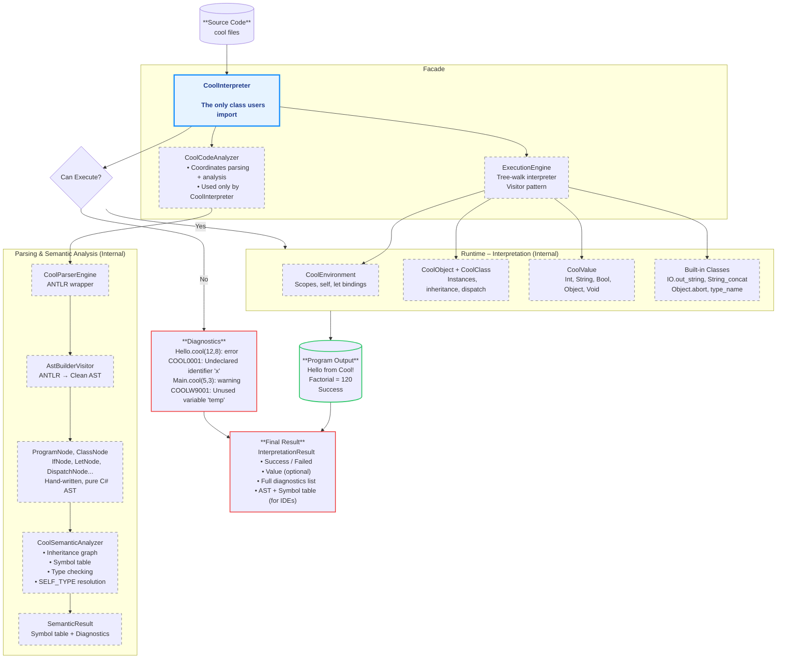

# Cool-Interpreter

## Concept


## Facade Usage
```csharp
var interpreter = new CoolInterpreter();

var result = interpreter.RunFile("examples/hello.cool");
Console.WriteLine(result.Output);

var result2 = interpreter.Run("""
    class Main inherits IO {
        main(): Object {
            out_string("Hello, Cool!\n")
        };
    };
    """);
```

