# COOL Interpreter Documentation Index

## Project Report
**Authors:** Michael Füby, Armin Zimmerling, Mahmoud Ibrahim  
**Institution:** FH Wiener Neustadt  
**Course:** Compiler Construction (M.INFO.B.24.WS25)  
**Date:** January 2026

---

## Documentation Structure

This documentation provides a comprehensive overview of the COOL (Classroom Object-Oriented Language) Interpreter implementation, including architecture, implementation details, testing strategy, and technical specifications.

### 📚 Documentation Files

1. **[01-ARCHITECTURE.md](./docs/01-ARCHITECTURE.md)** - System Architecture
    - High-level system overview
    - Component architecture
    - Design patterns and principles
    - Layered architecture explanation

2. **[02-PARSING.md](./docs/02-PARSING.md)** - Lexical Analysis & Parsing
    - ANTLR4 grammar integration
    - Lexical analysis process
    - Syntax analysis and parse tree generation
    - AST (Abstract Syntax Tree) construction
    - Error handling during parsing

3. **[03-SEMANTIC-ANALYSIS.md](./docs/03-SEMANTIC-ANALYSIS.md)** - Semantic Analysis
    - Symbol table construction
    - Type checking implementation
    - Inheritance graph validation
    - SELF_TYPE resolution
    - Semantic error detection

4. **[04-RUNTIME.md](./docs/04-RUNTIME.md)** - Runtime Execution
    - Tree-walk interpreter implementation
    - Object model and memory management
    - Method dispatch mechanism
    - Built-in classes (Object, IO, Int, String, Bool)
    - Runtime error handling

5. **[05-DIAGNOSTICS.md](./docs/05-DIAGNOSTICS.md)** - Error Handling & Diagnostics
    - Diagnostic system architecture
    - Error codes and categorization
    - Error reporting strategy
    - Warning and informational messages

6. **[06-TESTING.md](./docs/06-TESTING.md)** - Testing Strategy
    - Test suite organization
    - Unit testing approach
    - Integration testing methodology
    - Test case structure and coverage
    - Automated testing with NUnit

7. **[07-API-REFERENCE.md](./docs/07-API-REFERENCE.md)** - API Reference
    - Public API documentation
    - CoolInterpreter facade usage
    - InterpretationResult structure
    - Extension points

8. **[08-IMPLEMENTATION-DETAILS.md](./docs/08-IMPLEMENTATION-DETAILS.md)** - Implementation Details
    - Code organization
    - Key design decisions
    - Performance considerations
    - Known limitations

---

## Quick Start

### Using the Interpreter

```csharp
using Cool.Interpreter.Lib.Language.Interpretation;

// Create interpreter instance
var interpreter = new CoolInterpreter();

// Execute Cool code
var result = interpreter.Run("""
    class Main inherits IO {
        main(): Object {
            out_string("Hello, COOL!\n")
        };
    };
    """);

// Check results
if (result.IsSuccess)
{
    Console.WriteLine("Execution successful!");
    Console.WriteLine($"Output: {result.Output}");
}
else
{
    Console.WriteLine("Execution failed:");
    foreach (var diagnostic in result.Diagnostics)
    {
        Console.WriteLine($"  {diagnostic}");
    }
}
```

### Running from File

```csharp
var result = interpreter.RunFile("examples/hello.cool");
Console.WriteLine(result.Output);
```

---

## Project Overview

### What is COOL?

COOL (Classroom Object-Oriented Language) is a small object-oriented language designed for teaching compiler construction. It includes:

- **Object-oriented features:** Classes, inheritance, method dispatch
- **Static typing:** Compile-time type checking with SELF_TYPE support
- **Built-in types:** Int, String, Bool, and Object
- **Pattern matching:** Case expressions for type-based dispatch
- **Automatic memory management:** No manual memory allocation

### Interpreter Architecture

The interpreter follows a **three-phase architecture**:

```
Source Code → [Parsing] → AST → [Semantic Analysis] → Validated AST → [Runtime] → Result
```

1. **Parsing Phase:** Converts source code into an Abstract Syntax Tree (AST)
2. **Semantic Analysis Phase:** Validates types, inheritance, and symbols
3. **Runtime Phase:** Executes the validated AST using tree-walk interpretation

### Key Design Principles

- **Facade Pattern:** Single entry point (`CoolInterpreter`) for all operations
- **Separation of Concerns:** Clear boundaries between parsing, analysis, and execution
- **Immutability:** Symbol tables and AST nodes are immutable
- **Comprehensive Diagnostics:** Rich error reporting with source locations
- **Testability:** Extensive test suite with automated test case discovery

---

## Implementation Highlights

### Technologies Used

- **Language:** C# 10.0 / .NET 9.0
- **Parser Generator:** ANTLR4 (4.6.6)
- **Testing Framework:** NUnit 3.12.0
- **Architecture:** Facade + Visitor patterns

### Code Structure

```
Cool.Interpreter.Lib/
├── Antlr4/              # Generated ANTLR4 lexer and parser (auto-generated)
├── Core/                # Core infrastructure
│   ├── Diagnostics/     # Error reporting system
│   ├── Exceptions/      # Custom exception types
│   └── Syntax/          # AST node definitions
└── Language/            # Language-specific implementation
    ├── Analysis/        # Semantic analysis
    ├── Classes/         # Runtime object model
    ├── Evaluation/      # Tree-walk interpreter
    ├── Interpretation/  # Facade (CoolInterpreter)
    ├── Parsing/         # ANTLR wrapper and AST builder
    └── Symbols/         # Symbol table

Cool.Interpreter.Tests/
├── ParserTests.cs       # Parsing tests
├── SemanticTests.cs     # Semantic analysis tests
├── RuntimeTests.cs      # Runtime execution tests
└── AlgorithmTests.cs    # Full program execution tests
```

---

## Contributors

- **Michael Füby**
- **Armin Zimmerling**
- **Mahmoud Ibrahim** 

---

## References

- [COOL Language Manual](http://theory.stanford.edu/~aiken/software/cool/cool-manual.pdf)
- [ANTLR4 Documentation](https://www.antlr.org/)
- [Compiler Design Patterns](https://martinfowler.com/articles/refactoring-document-load.html)

---

**Next:** Start with [./docs/01-ARCHITECTURE.md](01-ARCHITECTURE.md) for a comprehensive overview of the system architecture.


## First Concept draft

```mermaid

flowchart TD
    %% ========================= INPUT =========================
    A[("
    **Source Code**
    cool files
    ")] --> InterpreterFacade

    subgraph Facade ["Facade"]
        direction TB
        InterpreterFacade[CoolInterpreter

        The only class users import]
        
        InterpreterFacade --> Analyzer
        InterpreterFacade --> RuntimeEngine
    end

    subgraph Frontend ["Parsing & Semantic Analysis (Internal)"]
         direction TB
        Analyzer[CoolCodeAnalyzer
        • Coordinates parsing + analysis
        • Used only by CoolInterpreter]

        Analyzer --> Parser

        Parser[CoolParserEngine
        ANTLR wrapper]

        Parser --> Builder
        Builder[AstBuilderVisitor
        ANTLR → Clean AST]

        Builder --> AST[ProgramNode, ClassNode
        IfNode, LetNode, DispatchNode...
        Hand-written, pure C# AST]

        AST --> Semantic
        Semantic[CoolSemanticAnalyzer
        • Inheritance graph
        • Symbol table
        • Type checking
        • SELF_TYPE resolution]

        Semantic --> SemanticResult[SemanticResult
        Symbol table + Diagnostics]
    end

    %% ========================= RUNTIME (Hidden) =========================
    subgraph Runtime ["Runtime – Interpretation (Internal)"]
        direction TB
        RuntimeEngine[ExecutionEngine
        Tree-walk interpreter
        Visitor pattern]

        RuntimeEngine --> Env[CoolEnvironment
        Scopes, self, let bindings]

        RuntimeEngine --> Obj[CoolObject + CoolClass
        Instances, inheritance, dispatch]

        RuntimeEngine --> Val[CoolValue
        Int, String, Bool, Object, Void]

        RuntimeEngine --> Builtins[Built-in Classes
        IO.out_string, String_concat
        Object.abort, type_name]
    end

    %% ========================= DECISION & OUTPUT =========================
    InterpreterFacade --> Decision{Can Execute?}

    Decision -->|Yes| Runtime
    Decision -->|No| DiagOutput

    Runtime --> SuccessOutput[("
    **Program Output**
    Hello from Cool!
    Factorial = 120
    Success
    ")]

    DiagOutput["
    **Diagnostics**
    Hello.cool(12,8): error COOL0001: Undeclared identifier 'x'
    Main.cool(5,3): warning COOLW9001: Unused variable 'temp'
    "]

    SuccessOutput --> FinalOutput
    DiagOutput --> FinalOutput

    FinalOutput["
    **Final Result**
    InterpretationResult
    • Success / Failed
    • Value (optional)
    • Full diagnostics list
    • AST + Symbol table (for IDEs)
    "]

    %% ========================= STYLING =========================
    classDef facade fill:#e6f3ff,stroke:#1890ff,stroke-width:3px,color:#1e3a8a,font-weight:bold
    classDef internal fill:#f9f99,stroke:#666,stroke-dasharray: 6 6
    classDef output fill:#f0df4,stroke:#22c55e,stroke-width:2px
    classDef error fill:#feff2,stroke:#ef4444,stroke-width:2px

    class InterpreterFacade facade
    class Analyzer,Parser,Builder,AST,Semantic,SemanticResult,RuntimeEngine,Env,Obj,Val,Builtins internal
    class SuccessOutput output
    class DiagOutput,FinalOutput error

```


## Facade Usage
```csharp
var interpreter = new CoolInterpreter();

var result = interpreter.RunFile("examples/hello.cool");
Console.WriteLine(result.Output);

var result2 = interpreter.Run("""
    class Main inherits IO {
        main(): Object {
            out_string("Hello, Cool!\n")
        };
    };
    """);
```

