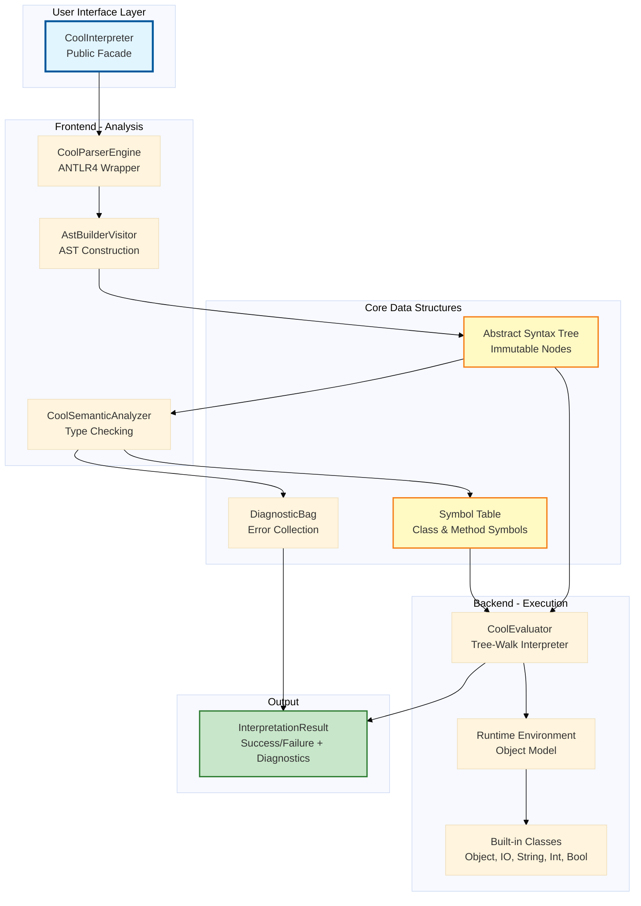
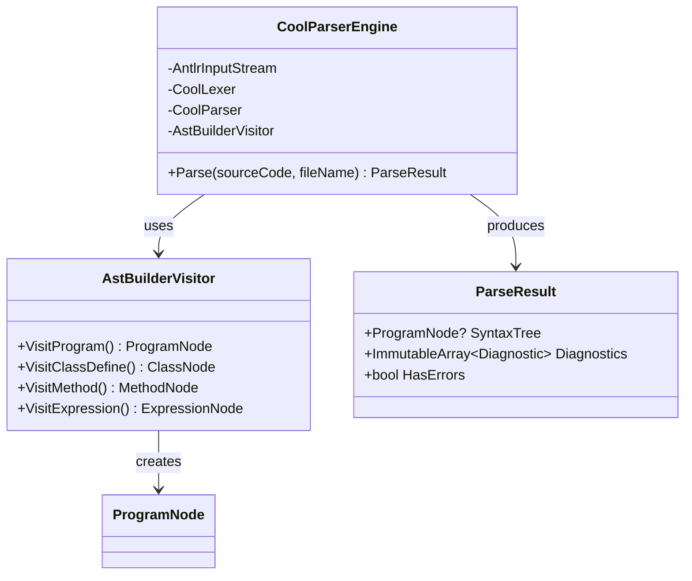
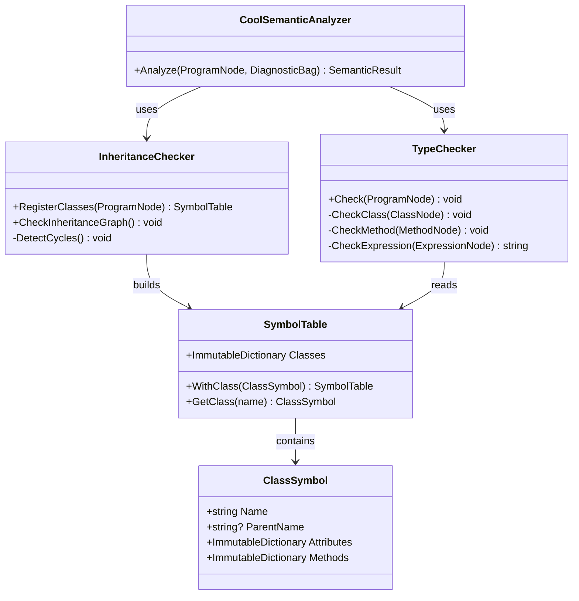
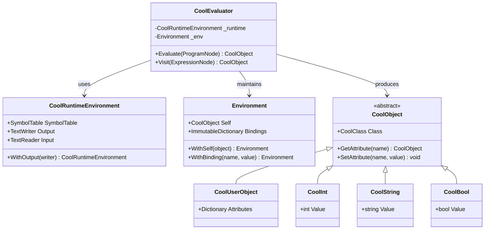
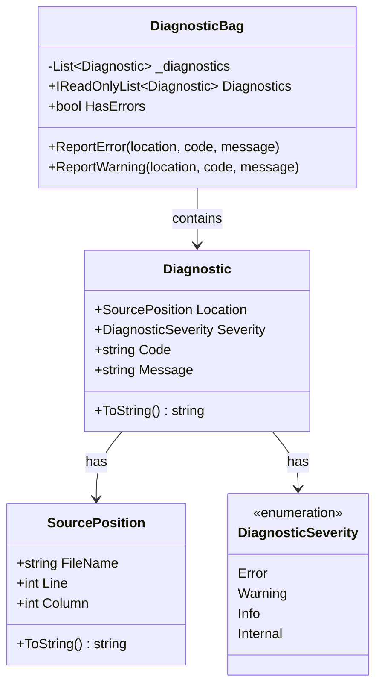
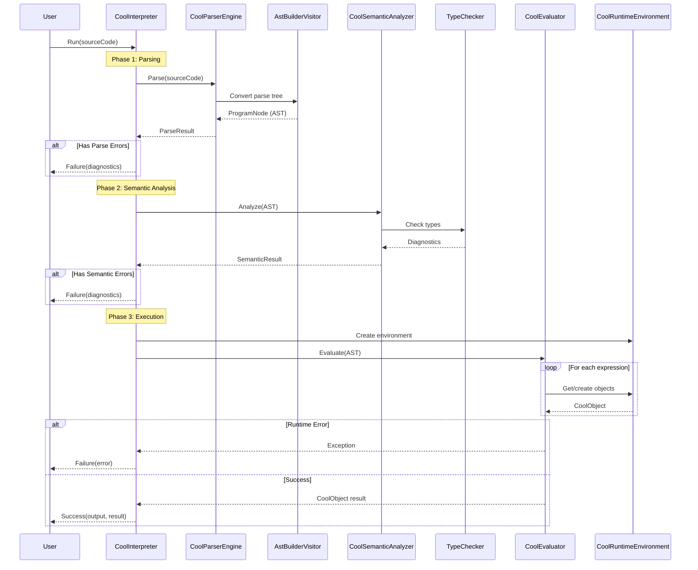

# System Architecture

## Table of Contents
1. [Overview](#overview)
2. [High-Level Architecture](#high-level-architecture)
3. [Component Architecture](#component-architecture)
4. [Design Patterns](#design-patterns)
5. [Data Flow](#data-flow)
6. [Layer Responsibilities](#layer-responsibilities)

---

## Overview

The COOL Interpreter is built following a **multi-phase compiler architecture** adapted for interpretation. The system is designed with clear separation of concerns, immutable data structures, and comprehensive error handling.

### Key Architectural Principles

1. **Facade Pattern:** Single entry point for all interpreter operations
2. **Separation of Concerns:** Clear boundaries between parsing, semantic analysis, and execution
3. **Immutability:** AST nodes, symbol tables, and diagnostic collections are immutable
4. **Pure Functions:** Most components are side-effect-free (except I/O operations)
5. **Fail-Fast:** Errors are detected early and prevent subsequent phases from running
6. **Comprehensive Diagnostics:** All errors include source location and meaningful messages

---

## High-Level Architecture



---

## Component Architecture

### 1. **CoolInterpreter (Facade)**

**Location:** `Language/Interpretation/CoolInterpreter.cs`

The single entry point for all interpreter operations. Orchestrates the three-phase execution:

```csharp
public class CoolInterpreter : IInterpreter
{
    private readonly CoolParserEngine _parser;
    private readonly CoolSemanticAnalyzer _analyzer;
    
    public InterpretationResult Run(string sourceCode, string? sourceName = null)
    {
        // Phase 1: Parsing
        // Phase 2: Semantic Analysis
        // Phase 3: Execution
    }
}
```

**Responsibilities:**
- Coordinate all three phases
- Handle phase transitions
- Aggregate diagnostics from all phases
- Provide testing hooks (`TestParsing`, `TestSemantics`)

---

### 2. **Parsing Layer**



**Components:**

#### a) **CoolParserEngine**
- Wraps ANTLR4-generated lexer and parser
- Configures error listeners for diagnostic collection
- Delegates AST construction to `AstBuilderVisitor`

#### b) **AstBuilderVisitor**
- Converts ANTLR parse tree → Clean AST
- Only class that knows about ANTLR context types
- Creates immutable, type-safe AST nodes

**Key Files:**
- `Language/Parsing/CoolParserEngine.cs`
- `Language/Parsing/AstBuilderVisitor.cs`
- `Core/Syntax/Ast/*.cs` (AST node definitions)

---

### 3. **Semantic Analysis Layer**



**Phases:**

1. **Class Registration** (`InheritanceChecker`)
   - Register all user-defined classes
   - Detect duplicate class definitions
   - Prevent redefinition of built-in classes

2. **Inheritance Validation** (`InheritanceChecker`)
   - Build inheritance graph
   - Detect cycles
   - Validate parent classes exist

3. **Type Checking** (`TypeChecker`)
   - Check attribute types
   - Check method signatures
   - Type check all expressions
   - Validate method overrides
   - Resolve SELF_TYPE

**Key Files:**
- `Language/Analysis/CoolSemanticAnalyzer.cs`
- `Language/Analysis/Checker/InheritanceChecker.cs`
- `Language/Analysis/Checker/TypeChecker.cs`
- `Language/Symbols/SymbolTable.cs`
- `Language/Symbols/ClassSymbol.cs`

---

### 4. **Runtime Execution Layer**



**Components:**

#### a) **CoolEvaluator (Tree-Walk Interpreter)**
- Implements `ICoolSyntaxVisitor<CoolObject>`
- Traverses AST and evaluates expressions
- Handles method dispatch and dynamic binding
- Manages evaluation environment (scopes, bindings)

#### b) **CoolRuntimeEnvironment**
- Global runtime state
- Symbol table reference
- I/O streams (configurable for testing)

#### c) **Environment**
- Execution environment for a single method/block
- Tracks `self` reference
- Variable bindings (let, case)

#### d) **Object Model**
- `CoolObject`: Abstract base class
- `CoolUserObject`: User-defined class instances
- `CoolInt`, `CoolString`, `CoolBool`: Primitive values

**Key Files:**
- `Language/Evaluation/CoolEvaluator.cs`
- `Language/Evaluation/CoolRuntimeEnvironment.cs`
- `Language/Evaluation/Environment.cs`
- `Language/Classes/CoolObject.cs`
- `Language/Classes/CoolUserObject.cs`
- `Language/Classes/BuiltIn/*.cs`

---

### 5. **Diagnostics System**



**Features:**
- Collect errors, warnings, and info messages
- Each diagnostic includes:
  - Source location (file, line, column)
  - Severity level
  - Error code (e.g., `COOL0001`)
  - Descriptive message
- Formatted output: `FileName(Line,Column): severity CODE: Message`

**Key Files:**
- `Core/Diagnostics/DiagnosticBag.cs`
- `Core/Diagnostics/Diagnostic.cs`
- `Core/Diagnostics/CoolErrorCodes.cs`
- `Core/Syntax/SourcePosition.cs`

---

## Design Patterns

### 1. **Facade Pattern**

**Purpose:** Simplify the complex multi-phase compilation process

```csharp
// Complex subsystems hidden behind simple interface
var interpreter = new CoolInterpreter();
var result = interpreter.Run(sourceCode);
```

**Benefits:**
- Single entry point for all operations
- Hides internal complexity
- Easy to use and test

---

### 2. **Visitor Pattern**

**Purpose:** Separate AST traversal from node operations

```csharp
public interface ICoolSyntaxVisitor<T>
{
    T Visit(IntegerLiteralNode node);
    T Visit(StringLiteralNode node);
    T Visit(BinaryOperationNode node);
    // ... more visit methods
}
```

**Implementations:**
- `AstBuilderVisitor`: ANTLR parse tree → AST
- `CoolEvaluator`: AST → CoolObject (execution)
- Type checking visitors in semantic analysis

**Benefits:**
- Add new operations without modifying AST nodes
- Clean separation of concerns
- Easy to maintain and extend

---

### 3. **Immutable Data Structures**

**Purpose:** Prevent accidental modifications and simplify reasoning

**Examples:**
- `SymbolTable.WithClass()` returns new instance
- AST nodes are immutable once created
- Diagnostic collections use `ImmutableArray`

**Benefits:**
- Thread-safe by design
- No defensive copying needed
- Easy to reason about data flow

---

### 4. **Builder Pattern**

**Purpose:** Construct complex objects step by step

```csharp
var runtimeEnv = new CoolRuntimeEnvironment(symbolTable)
    .WithOutput(outputBuffer)
    .WithInput(new StringReader("input"));
```

**Benefits:**
- Fluent, readable API
- Optional configuration
- Immutable final objects

---

## Data Flow

### Complete Interpretation Flow



---

## Layer Responsibilities

### Frontend Layer (Parsing & Analysis)

**Responsibility:** Transform source code into validated, executable representation

**Components:**
- `CoolParserEngine` - Lexical and syntax analysis
- `AstBuilderVisitor` - AST construction
- `CoolSemanticAnalyzer` - Type checking and validation

**Output:** Validated AST + Symbol Table + Diagnostics

---

### Core Layer (Data Structures)

**Responsibility:** Define fundamental data types used across all layers

**Components:**
- AST node definitions (`ProgramNode`, `ClassNode`, `ExpressionNode`, etc.)
- `SymbolTable` and symbol types
- `DiagnosticBag` and diagnostic types
- Exception types

**Characteristics:** Immutable, pure data structures

---

### Backend Layer (Execution)

**Responsibility:** Execute validated programs and produce results

**Components:**
- `CoolEvaluator` - Tree-walk interpreter
- `CoolRuntimeEnvironment` - Global runtime state
- `Environment` - Method/block execution context
- Object model - Runtime representation of COOL objects

**Output:** Program result + captured I/O + diagnostics

---

### Facade Layer (Public API)

**Responsibility:** Provide simple, unified interface to users

**Components:**
- `CoolInterpreter` - Main facade
- `InterpretationResult` - Result wrapper
- `IInterpreter` - Public interface

**Characteristics:**
- Simple API
- Hides internal complexity
- Comprehensive result reporting

---

## Key Architectural Decisions

### 1. **Three-Phase Architecture**

**Decision:** Separate parsing, semantic analysis, and execution into distinct phases

**Rationale:**
- Clear separation of concerns
- Fail-fast error handling
- Easier to test and maintain
- Standard compiler architecture pattern

---

### 2. **Immutable AST and Symbol Table**

**Decision:** Use immutable data structures for AST and symbols

**Rationale:**
- Thread-safe by design
- Prevents accidental modifications
- Enables safe caching and reuse
- Simplifies reasoning about data flow

---

### 3. **Facade Pattern for Public API**

**Decision:** Single `CoolInterpreter` class as entry point

**Rationale:**
- Simplifies user experience
- Hides internal complexity
- Easy to version and evolve
- Clear contract for users

---

### 4. **Tree-Walk Interpretation**

**Decision:** Direct AST evaluation instead of bytecode compilation

**Rationale:**
- Simpler implementation
- Sufficient performance for teaching purposes
- Easier to debug
- Matches course requirements

---

### 5. **Comprehensive Diagnostics**

**Decision:** Collect all errors with source locations and codes

**Rationale:**
- Better user experience
- Easier debugging
- Professional error reporting
- Enables IDE integration

---

**Next:** Continue to [02-PARSING.md](02-PARSING.md) for detailed parsing implementation.
