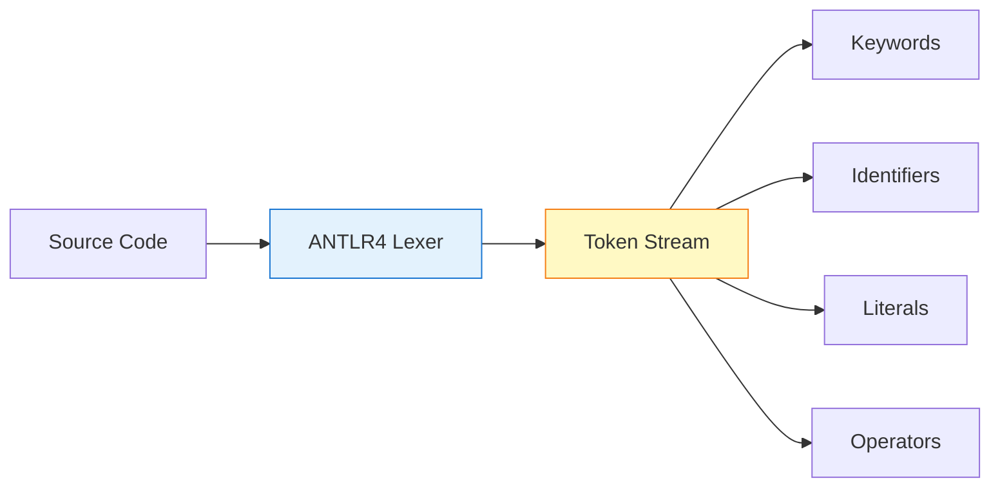
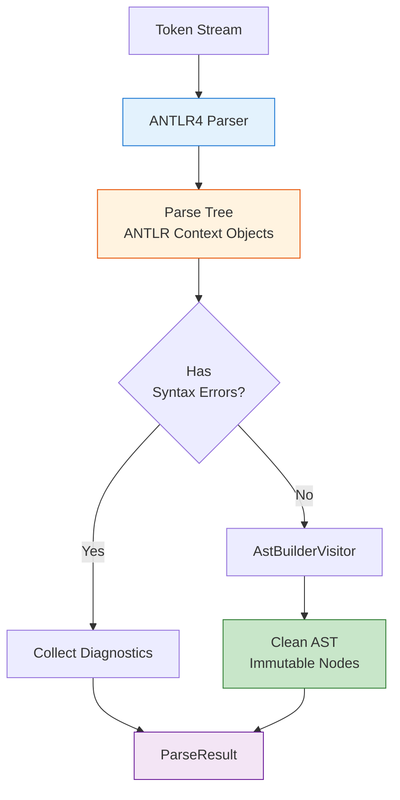
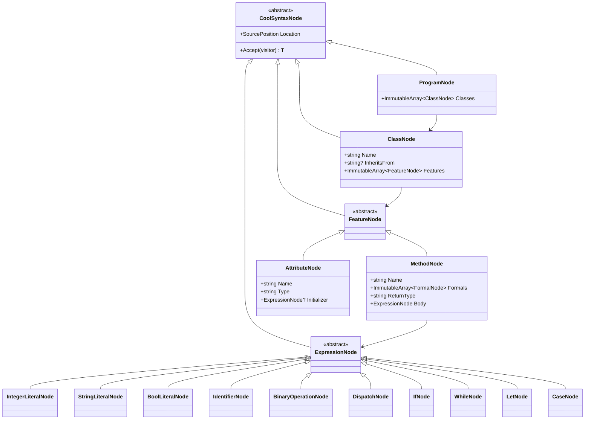
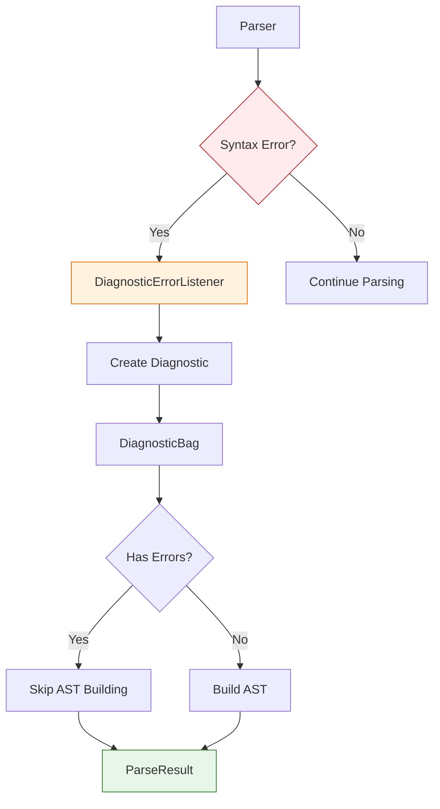
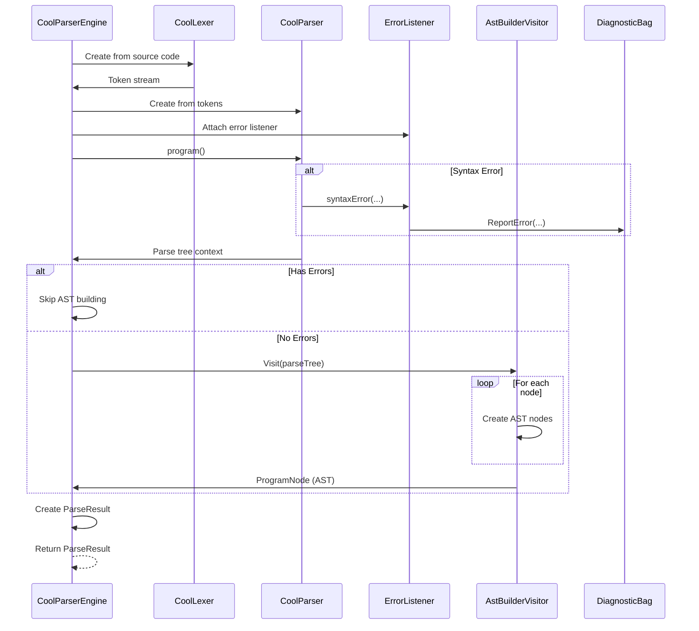

# Lexical Analysis & Parsing

## Table of Contents
1. [Overview](#overview)
2. [ANTLR4 Grammar](#antlr4-grammar)
3. [Lexical Analysis](#lexical-analysis)
4. [Syntax Analysis](#syntax-analysis)
5. [AST Construction](#ast-construction)
6. [Error Handling](#error-handling)

---

## Overview

The parsing phase transforms COOL source code into an Abstract Syntax Tree (AST). This phase consists of two main steps:

1. **Lexical Analysis:** Tokenization of source code
2. **Syntax Analysis:** Parse tree construction and AST building

The implementation uses **ANTLR4** (ANother Tool for Language Recognition) for lexer and parser generation, while maintaining clean separation through custom AST nodes.

---

## ANTLR4 Grammar

### Grammar File Structure

**Location:** `Antlr4/Cool.g4`

The COOL grammar defines:
- **Lexer rules:** Token patterns (keywords, identifiers, literals)
- **Parser rules:** Language syntax structure
- **Comments:** Single-line (`--`) and multi-line (`(* ... *)`)

### Key Grammar Rules

```antlr
// Program structure
program : classDefine+ ;

classDefine 
    : CLASS TYPE (INHERITS TYPE)? '{' feature* '}' ';'
    ;

// Features (methods and attributes)
feature
    : ID '(' formal_list ')' ':' TYPE '{' expression '}' ';'  # method
    | ID ':' TYPE (ASSIGN expression)? ';'                     # property
    ;

// Expressions (partial)
expression
    : expression '@' TYPE '.' ID '(' expression_list ')'      # dispatchExplicit
    | expression '.' ID '(' expression_list ')'               # dispatchImplicit
    | IF expression THEN expression ELSE expression FI        # if
    | WHILE expression LOOP expression POOL                   # while
    | LET let_binding_list IN expression                      # let
    | CASE expression OF case_branch+ ESAC                    # case
    | NEW TYPE                                                # new
    | ISVOID expression                                       # isvoid
    | expression '+' expression                               # add
    | expression '-' expression                               # sub
    | expression '*' expression                               # mul
    | expression '/' expression                               # div
    | '~' expression                                          # negate
    | expression '<' expression                               # lessThan
    | expression '<=' expression                              # lessEqual
    | expression '=' expression                               # equal
    | NOT expression                                          # not
    | '(' expression ')'                                      # parentheses
    | ID ASSIGN expression                                    # assign
    | ID                                                      # id
    | INTEGER                                                 # integer
    | STRING                                                  # string
    | TRUE                                                    # true
    | FALSE                                                   # false
    ;
```

### Operator Precedence

The grammar encodes operator precedence through rule ordering:

1. `.` (dispatch) - highest precedence
2. `@` (static dispatch)
3. `~` (integer complement)
4. `isvoid`
5. `*`, `/` (multiplication, division)
6. `+`, `-` (addition, subtraction)
7. `<`, `<=`, `=` (comparison)
8. `not` (boolean negation)
9. `<-` (assignment) - lowest precedence

---

## Lexical Analysis

### Token Categories

#### 1. **Keywords** (Case-insensitive except `true`/`false`)
```
class, inherits, if, then, else, fi, while, loop, pool,
let, in, case, of, esac, new, isvoid, not
```

#### 2. **Identifiers**
- **Type names:** Start with uppercase letter (e.g., `Main`, `String`)
- **Object names:** Start with lowercase letter (e.g., `main`, `x`)
- Pattern: `[a-z][a-zA-Z0-9_]*` or `[A-Z][a-zA-Z0-9_]*`

#### 3. **Literals**
- **Integers:** `[0-9]+`
- **Strings:** `"..."` (with escape sequences: `\n`, `\t`, `\"`, `\\`)
- **Booleans:** `true`, `false` (case-sensitive)

#### 4. **Operators and Punctuation**
```
+ - * / < <= = <- => . , ; : ( ) { } @ ~
```

#### 5. **Comments**
- Single-line: `-- comment text`
- Multi-line: `(* comment text *)`

### Lexer Implementation



**Generated Files:**
- `Antlr4/CoolLexer.cs` - Auto-generated lexer
- `Antlr4/CoolLexer.tokens` - Token definitions

**Key Features:**
- Case-insensitive keywords (except boolean literals)
- Nested comment support
- String escape sequence handling
- Whitespace and comment filtering

---

## Syntax Analysis

### Parser Architecture



### CoolParserEngine

**Location:** `Language/Parsing/CoolParserEngine.cs`

This class wraps ANTLR4-generated components and provides a clean interface:

```csharp
public class CoolParserEngine
{
    public ParseResult Parse(string sourceCode, string sourceName)
    {
        // 1. Create input stream
        var inputStream = new AntlrInputStream(sourceCode);
        
        // 2. Create lexer
        var lexer = new CoolLexer(inputStream);
        var tokens = new CommonTokenStream(lexer);
        
        // 3. Create parser with error listener
        var parser = new CoolParser(tokens);
        var diagnostics = new DiagnosticBag();
        
        parser.RemoveErrorListeners();
        parser.AddErrorListener(new DiagnosticErrorListener(diagnostics, sourceName));
        
        // 4. Parse program rule
        var programContext = parser.program();
        
        // 5. Build clean AST if no errors
        ProgramNode? syntaxTree = null;
        if (!diagnostics.HasErrors)
        {
            var astBuilder = new AstBuilderVisitor(sourceName);
            syntaxTree = astBuilder.Visit(programContext) as ProgramNode;
        }
        
        return new ParseResult(syntaxTree, diagnostics.Diagnostics);
    }
}
```

**Responsibilities:**
- Configure ANTLR lexer and parser
- Attach custom error listeners
- Delegate AST building to visitor
- Package results with diagnostics

---

## AST Construction

### AST Node Hierarchy



### AstBuilderVisitor

**Location:** `Language/Parsing/AstBuilderVisitor.cs`

Converts ANTLR parse tree into clean, immutable AST nodes.

**Key Methods:**

#### Program Node Construction
```csharp
public override object? VisitProgram(CoolParser.ProgramContext context)
{
    var classes = context.classDefine()
        .Select(c => Visit(c) as ClassNode)
        .Where(c => c != null)
        .ToImmutableArray();
    
    return new ProgramNode(classes);
}
```

#### Class Node Construction
```csharp
public override object? VisitClassDefine(CoolParser.ClassDefineContext context)
{
    var name = context.TYPE(0).GetText();
    
    string? inheritsFrom = context.INHERITS() is not null
        ? context.TYPE(1).GetText()
        : null;
    
    var features = context.feature()
        .Select(f => Visit(f) as FeatureNode)
        .Where(f => f != null)
        .ToImmutableArray();
    
    var location = ToSourcePosition(context.TYPE(0).Symbol);
    
    return new ClassNode(name, inheritsFrom, features, location);
}
```

#### Method Node Construction
```csharp
public override object? VisitMethod(CoolParser.MethodContext context)
{
    var id = context.ID().GetText();
    var returnType = context.TYPE().GetText();
    
    var formals = context.formal()
        .Select(Visit)
        .Cast<FormalNode>()
        .ToImmutableArray();
    
    var body = Visit(context.expression()) as ExpressionNode
               ?? new NoExpressionNode(ToSourcePosition(context.expression().Start));
    
    var location = ToSourcePosition(context.Start);
    
    return new MethodNode(id, formals, returnType, body, location);
}
```

#### Expression Handling Examples

**Binary Operation:**
```csharp
public override object? VisitAdd(CoolParser.AddContext context)
{
    var left = Visit(context.expression(0)) as ExpressionNode;
    var right = Visit(context.expression(1)) as ExpressionNode;
    
    return new BinaryOperationNode(
        left!, 
        BinaryOperator.Add, 
        right!, 
        ToSourcePosition(context.Start)
    );
}
```

**If Expression:**
```csharp
public override object? VisitIf(CoolParser.IfContext context)
{
    var condition = Visit(context.expression(0)) as ExpressionNode;
    var thenBranch = Visit(context.expression(1)) as ExpressionNode;
    var elseBranch = Visit(context.expression(2)) as ExpressionNode;
    
    return new IfNode(
        condition!, 
        thenBranch!, 
        elseBranch!, 
        ToSourcePosition(context.Start)
    );
}
```

**Let Expression:**
```csharp
public override object? VisitLet(CoolParser.LetContext context)
{
    var bindings = context.let_binding()
        .Select(lb => {
            var name = lb.ID().GetText();
            var type = lb.TYPE().GetText();
            var initializer = lb.expression() != null 
                ? Visit(lb.expression()) as ExpressionNode 
                : null;
            return new LetBinding(name, type, initializer);
        })
        .ToImmutableArray();
    
    var body = Visit(context.expression()) as ExpressionNode;
    
    return new LetNode(bindings, body!, ToSourcePosition(context.Start));
}
```

### Source Position Tracking

Every AST node includes source position for accurate error reporting:

```csharp
private SourcePosition ToSourcePosition(IToken token)
{
    return new SourcePosition(
        fileName: _filePath ?? "<unknown>",
        line: token.Line,
        column: token.Column
    );
}
```

---

## Error Handling

### Parse Error Detection



### DiagnosticErrorListener

Custom ANTLR error listener for collecting diagnostics:

```csharp
public class DiagnosticErrorListener : BaseErrorListener
{
    private readonly DiagnosticBag _diagnostics;
    private readonly string _fileName;
    
    public override void SyntaxError(
        TextWriter output,
        IRecognizer recognizer,
        IToken offendingSymbol,
        int line,
        int charPositionInLine,
        string msg,
        RecognitionException e)
    {
        var location = new SourcePosition(_fileName, line, charPositionInLine);
        
        _diagnostics.ReportError(
            location,
            CoolErrorCodes.SyntaxError,
            $"Syntax error: {msg}"
        );
    }
}
```

### Common Parse Errors

#### 1. **Missing Semicolon**
```cool
class Main {
    main(): Int { 42 }  -- Missing semicolon
};
```
**Error:** `Syntax error: missing ';' at '}'`

#### 2. **Invalid Token**
```cool
class Main {
    main(): Int { 42 $ };  -- Invalid character $
};
```
**Error:** `Syntax error: token recognition error at: '$'`

#### 3. **Mismatched Braces**
```cool
class Main {
    main(): Int { 42 };
-- Missing closing brace
```
**Error:** `Syntax error: missing '}' at '<EOF>'`

#### 4. **Invalid Expression**
```cool
class Main {
    main(): Int { + };  -- Operator without operands
};
```
**Error:** `Syntax error: mismatched input '+' expecting expression`

---

## Parsing Flow

### Complete Parsing Sequence



---

## Example: Parsing a Simple Program

### Input Code
```cool
class Main {
    main(): Int {
        42
    };
};
```

### Step 1: Lexical Analysis
```
Token Stream:
CLASS -> TYPE(Main) -> LBRACE -> ID(main) -> LPAREN -> RPAREN
-> COLON -> TYPE(Int) -> LBRACE -> INTEGER(42) -> RBRACE
-> SEMI -> RBRACE -> SEMI -> EOF
```

### Step 2: Parse Tree
```
program
└── classDefine
    ├── TYPE: "Main"
    └── feature (method)
        ├── ID: "main"
        ├── formal_list: (empty)
        ├── TYPE: "Int"
        └── expression
            └── integer: 42
```

### Step 3: AST Construction
```
ProgramNode
└── ClassNode("Main", inherits: null)
    └── MethodNode("main", formals: [], returnType: "Int")
        └── IntegerLiteralNode(42)
```

### Step 4: ParseResult
```csharp
ParseResult {
    SyntaxTree = ProgramNode { ... },
    Diagnostics = [],
    HasErrors = false
}
```

---

## Performance Considerations

### 1. **Lazy AST Construction**
- AST is only built if parsing succeeds without errors
- Avoids unnecessary work for invalid programs

### 2. **Immutable Collections**
- Use `ImmutableArray` for child nodes
- Prevents accidental modifications
- Enables safe sharing

### 3. **Single-Pass Parsing**
- One pass through the source code
- All syntax errors collected in single pass
- No backtracking

---

## Testing Strategy

### Parser Tests

**Location:** `Cool.Interpreter.Tests/ParserTests.cs`

```csharp
[TestFixture]
public class ParserTests
{
    [TestCaseSource(nameof(GetSuccessParsingFiles))]
    public void Parse_ValidFile_ReturnsSuccess(string filePath, string fileName)
    {
        var sourceCode = File.ReadAllText(filePath);
        var result = _interpreter.TestParsing(sourceCode, fileName);
        
        Assert.That(result.HasErrors, Is.False);
    }
    
    [TestCaseSource(nameof(GetFailedParsingFiles))]
    public void Parse_InvalidFile_ReturnsFailure(string filePath, string fileName)
    {
        var sourceCode = File.ReadAllText(filePath);
        var result = _interpreter.TestParsing(sourceCode, fileName);
        
        Assert.That(result.HasErrors, Is.True);
    }
}
```

**Test Cases:**
- `TestCases/Parsing/success/*.cl` - Valid syntax
- `TestCases/Parsing/fail/*.cl` - Invalid syntax

---

**Next:** Continue to [03-SEMANTIC-ANALYSIS.md](03-SEMANTIC-ANALYSIS.md) for semantic analysis details.
