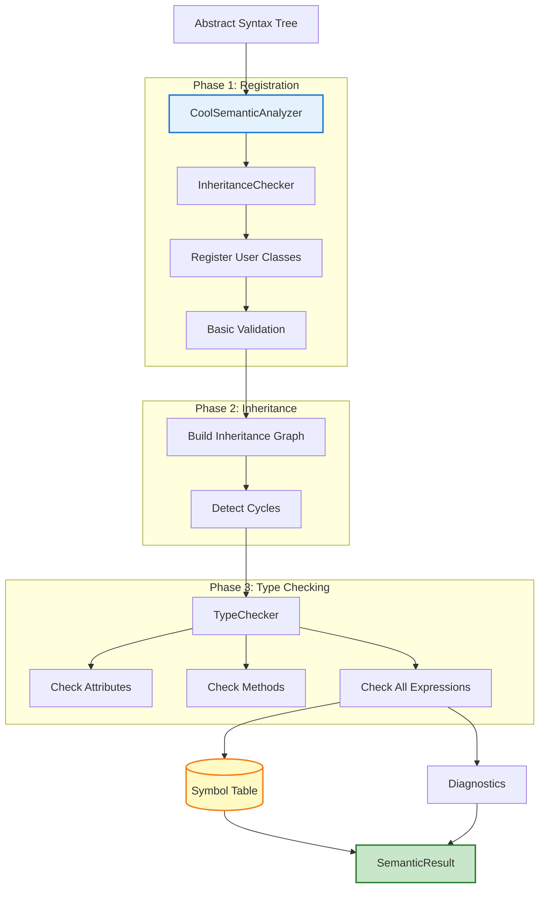
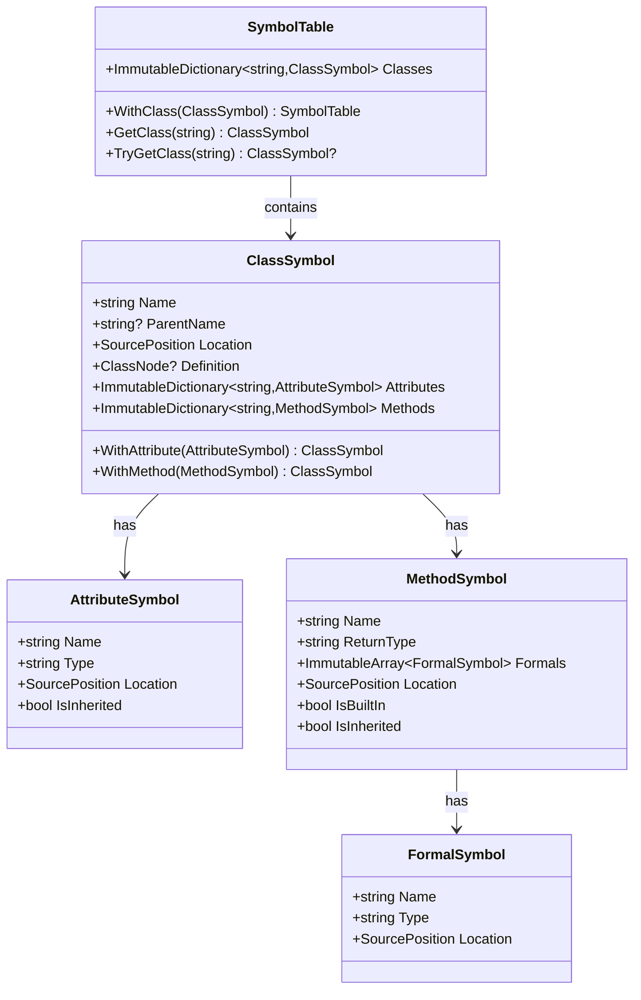
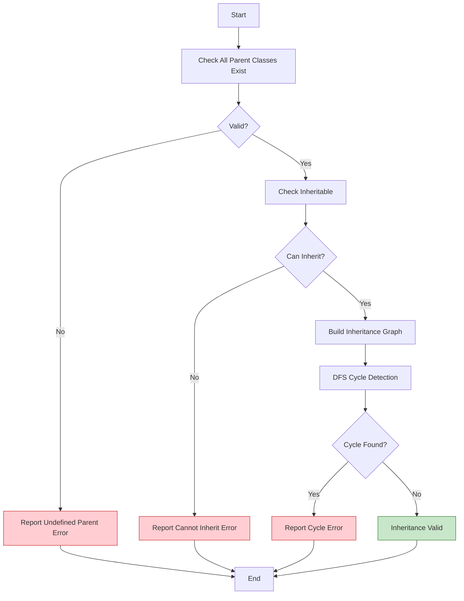
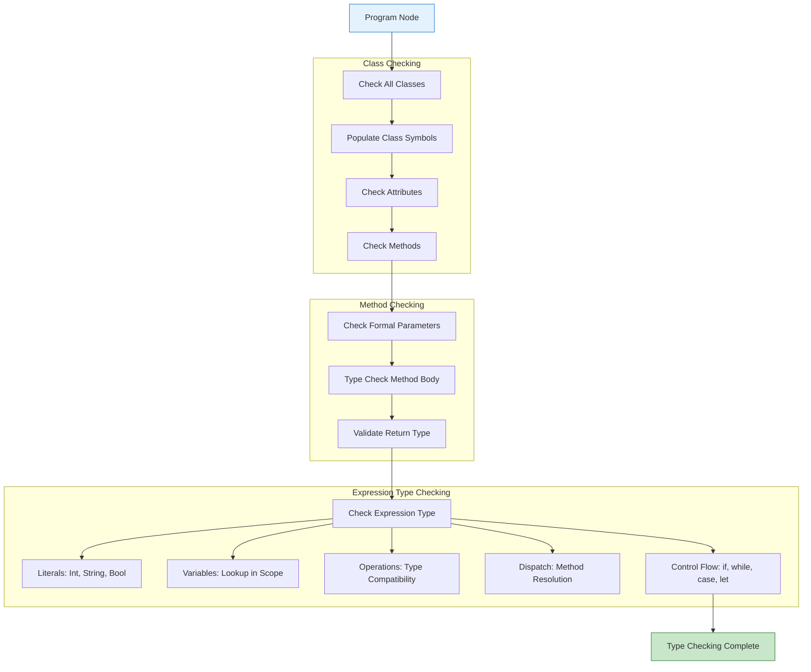

# Semantic Analysis

## Table of Contents
1. [Overview](#overview)
2. [Symbol Table](#symbol-table)
3. [Inheritance Checking](#inheritance-checking)
4. [Type Checking](#type-checking)
5. [SELF_TYPE Resolution](#self_type-resolution)
6. [Error Detection](#error-detection)

---

## Overview

Semantic analysis validates the correctness of a syntactically valid COOL program. This phase ensures:

- All classes are properly defined
- Inheritance relationships are valid
- Types are used correctly
- Methods and attributes are accessible
- SELF_TYPE is resolved properly

The semantic analyzer produces a **SymbolTable** containing all class, method, and attribute information needed for execution.

---

## Semantic Analysis Architecture



---

## Symbol Table

### Structure

The symbol table is an **immutable, hierarchical data structure** that stores information about all classes, methods, and attributes.



### Built-in Classes

The symbol table is pre-populated with COOL's built-in classes:

#### Object
Base class for all types
```cool
class Object {
    abort(): Object { ... };
    type_name(): String { ... };
    copy(): SELF_TYPE { ... };
};
```

#### IO
Input/output operations
```cool
class IO inherits Object {
    out_string(x: String): SELF_TYPE { ... };
    out_int(x: Int): SELF_TYPE { ... };
    in_string(): String { ... };
    in_int(): Int { ... };
};
```

#### Int
Integer values (primitive)
```cool
class Int inherits Object { };
```

#### String
String values with operations
```cool
class String inherits Object {
    length(): Int { ... };
    concat(s: String): String { ... };
    substr(i: Int, l: Int): String { ... };
};
```

#### Bool
Boolean values (primitive)
```cool
class Bool inherits Object { };
```

### Symbol Table Construction

```csharp
public class SymbolTable
{
    public static readonly SymbolTable Empty = CreateWithBuiltins();
    
    private static SymbolTable CreateWithBuiltins()
    {
        var builder = ImmutableDictionary.CreateBuilder<string, ClassSymbol>();
        
        // Object class
        var objectClass = new ClassSymbol("Object", null, SourcePosition.None)
            .WithMethod(MethodSymbol.CreateBuiltin("abort", "Object"))
            .WithMethod(MethodSymbol.CreateBuiltin("type_name", "String"))
            .WithMethod(MethodSymbol.CreateBuiltin("copy", "SELF_TYPE"));
        builder.Add("Object", objectClass);
        
        // IO class
        var ioClass = new ClassSymbol("IO", "Object", SourcePosition.None)
            .WithMethod(MethodSymbol.CreateBuiltin("out_string", "SELF_TYPE", ("x", "String")))
            .WithMethod(MethodSymbol.CreateBuiltin("out_int", "SELF_TYPE", ("x", "Int")))
            .WithMethod(MethodSymbol.CreateBuiltin("in_string", "String"))
            .WithMethod(MethodSymbol.CreateBuiltin("in_int", "Int"));
        builder.Add("IO", ioClass);
        
        // Int, String, Bool classes
        builder.Add("Int", new ClassSymbol("Int", "Object", SourcePosition.None));
        
        var stringClass = new ClassSymbol("String", "Object", SourcePosition.None)
            .WithMethod(MethodSymbol.CreateBuiltin("length", "Int"))
            .WithMethod(MethodSymbol.CreateBuiltin("concat", "String", ("s", "String")))
            .WithMethod(MethodSymbol.CreateBuiltin("substr", "String", ("i", "Int"), ("l", "Int")));
        builder.Add("String", stringClass);
        
        builder.Add("Bool", new ClassSymbol("Bool", "Object", SourcePosition.None));
        
        return new SymbolTable(builder.ToImmutable());
    }
}
```

---

## Inheritance Checking

### Phase 1: Class Registration

**Location:** `Language/Analysis/Checker/InheritanceChecker.cs`

```csharp
public class InheritanceChecker
{
    public SymbolTable RegisterClasses(ProgramNode program)
    {
        var symbolTable = SymbolTable.Empty;
        
        foreach (var classNode in program.Classes)
        {
            // Check for duplicate class
            if (symbolTable.TryGetClass(classNode.Name) != null)
            {
                _diagnostics.ReportError(
                    classNode.Location,
                    CoolErrorCodes.DuplicateClass,
                    $"Class '{classNode.Name}' is already defined"
                );
                continue;
            }
            
            // Check for built-in class redefinition
            if (IsBuiltInClass(classNode.Name))
            {
                _diagnostics.ReportError(
                    classNode.Location,
                    CoolErrorCodes.RedefineBuiltInClass,
                    $"Cannot redefine built-in class '{classNode.Name}'"
                );
                continue;
            }
            
            // Create class symbol
            var classSymbol = new ClassSymbol(
                classNode.Name,
                classNode.InheritsFrom,
                classNode.Location
            ).WithDefinition(classNode);
            
            symbolTable = symbolTable.WithClass(classSymbol);
        }
        
        return symbolTable;
    }
}
```

**Validations:**
- ✓ No duplicate class definitions
- ✓ Cannot redefine built-in classes (Object, IO, Int, String, Bool)
- ✓ Class names follow naming conventions

### Phase 2: Inheritance Graph Validation



**Implementation:**

```csharp
public void CheckInheritanceGraph()
{
    // Step 1: Validate parent classes exist
    foreach (var classSymbol in _symbolTable.Classes.Values)
    {
        if (classSymbol.ParentName != null)
        {
            var parent = _symbolTable.TryGetClass(classSymbol.ParentName);
            
            if (parent == null)
            {
                _diagnostics.ReportError(
                    classSymbol.Location,
                    CoolErrorCodes.UndefinedParentClass,
                    $"Parent class '{classSymbol.ParentName}' is not defined"
                );
            }
            else if (!CanInheritFrom(classSymbol.ParentName))
            {
                _diagnostics.ReportError(
                    classSymbol.Location,
                    CoolErrorCodes.CannotInheritFromClass,
                    $"Cannot inherit from '{classSymbol.ParentName}'"
                );
            }
        }
    }
    
    // Step 2: Detect cycles
    DetectInheritanceCycles();
}

private void DetectInheritanceCycles()
{
    var visited = new HashSet<string>();
    var inProgress = new HashSet<string>();
    
    foreach (var classSymbol in _symbolTable.Classes.Values)
    {
        if (!visited.Contains(classSymbol.Name))
        {
            if (HasCycle(classSymbol.Name, visited, inProgress))
            {
                _diagnostics.ReportError(
                    classSymbol.Location,
                    CoolErrorCodes.InheritanceCycle,
                    $"Class '{classSymbol.Name}' is part of an inheritance cycle"
                );
            }
        }
    }
}

private bool HasCycle(string className, HashSet<string> visited, HashSet<string> inProgress)
{
    if (inProgress.Contains(className))
        return true; // Cycle detected
        
    if (visited.Contains(className))
        return false; // Already checked
    
    visited.Add(className);
    inProgress.Add(className);
    
    var classSymbol = _symbolTable.GetClass(className);
    if (classSymbol.ParentName != null)
    {
        if (HasCycle(classSymbol.ParentName, visited, inProgress))
            return true;
    }
    
    inProgress.Remove(className);
    return false;
}
```

**Validations:**
- ✓ Parent classes exist
- ✓ Cannot inherit from Int, String, Bool, or SELF_TYPE
- ✓ No inheritance cycles

**Error Examples:**

```cool
-- Error: Undefined parent
class Foo inherits Bar { };  -- Bar doesn't exist

-- Error: Cannot inherit from Int
class MyInt inherits Int { };

-- Error: Inheritance cycle
class A inherits B { };
class B inherits A { };
```

---

## Type Checking

### TypeChecker Architecture

**Location:** `Language/Analysis/Checker/TypeChecker.cs`



### Type Checking Rules

#### 1. **Attribute Type Checking**

```csharp
private void CheckAttribute(ClassSymbol classSymbol, AttributeNode attribute)
{
    // Check type exists
    if (!IsValidType(attribute.Type))
    {
        _diagnostics.ReportError(
            attribute.Location,
            CoolErrorCodes.UndefinedType,
            $"Type '{attribute.Type}' is not defined"
        );
        return;
    }
    
    // Check initializer type (if present)
    if (attribute.Initializer != null)
    {
        var initType = CheckExpression(attribute.Initializer, classSymbol);
        
        if (!IsConformant(initType, attribute.Type, classSymbol))
        {
            _diagnostics.ReportError(
                attribute.Initializer.Location,
                CoolErrorCodes.TypeMismatch,
                $"Initializer type '{initType}' does not conform to declared type '{attribute.Type}'"
            );
        }
    }
}
```

#### 2. **Method Type Checking**

```csharp
private void CheckMethod(ClassSymbol classSymbol, MethodNode method)
{
    // Check return type exists
    if (!IsValidType(method.ReturnType))
    {
        _diagnostics.ReportError(
            method.Location,
            CoolErrorCodes.UndefinedType,
            $"Return type '{method.ReturnType}' is not defined"
        );
        return;
    }
    
    // Check formal parameter types
    foreach (var formal in method.Formals)
    {
        if (!IsValidType(formal.Type))
        {
            _diagnostics.ReportError(
                formal.Location,
                CoolErrorCodes.UndefinedType,
                $"Parameter type '{formal.Type}' is not defined"
            );
        }
    }
    
    // Type check method body
    var bodyType = CheckExpression(method.Body, classSymbol);
    
    // Validate return type conforms
    var expectedReturnType = method.ReturnType == "SELF_TYPE" 
        ? classSymbol.Name 
        : method.ReturnType;
    
    if (!IsConformant(bodyType, expectedReturnType, classSymbol))
    {
        _diagnostics.ReportError(
            method.Body.Location,
            CoolErrorCodes.TypeMismatch,
            $"Method body type '{bodyType}' does not conform to return type '{method.ReturnType}'"
        );
    }
}
```

#### 3. **Expression Type Checking**

**Literals:**
```csharp
public string Visit(IntegerLiteralNode node) => "Int";
public string Visit(StringLiteralNode node) => "String";
public string Visit(BoolLiteralNode node) => "Bool";
```

**Identifiers:**
```csharp
public string Visit(IdentifierNode node)
{
    // Look up in current scope (let bindings, formals)
    if (_scope.TryGetVariable(node.Name, out var type))
        return type;
    
    // Look up as attribute
    var attr = _currentClass.TryGetAttribute(node.Name);
    if (attr != null)
        return attr.Type;
    
    // Undefined identifier
    _diagnostics.ReportError(
        node.Location,
        CoolErrorCodes.UndeclaredIdentifier,
        $"Undeclared identifier '{node.Name}'"
    );
    
    return "Object"; // Error recovery
}
```

**Binary Operations:**
```csharp
public string Visit(BinaryOperationNode node)
{
    var leftType = CheckExpression(node.Left);
    var rightType = CheckExpression(node.Right);
    
    switch (node.Operator)
    {
        case BinaryOperator.Add:
        case BinaryOperator.Sub:
        case BinaryOperator.Mul:
        case BinaryOperator.Div:
            // Both operands must be Int
            if (leftType != "Int")
                ReportError(node.Left, "Int", leftType);
            if (rightType != "Int")
                ReportError(node.Right, "Int", rightType);
            return "Int";
            
        case BinaryOperator.LessThan:
        case BinaryOperator.LessEqual:
            // Both operands must be Int, result is Bool
            if (leftType != "Int")
                ReportError(node.Left, "Int", leftType);
            if (rightType != "Int")
                ReportError(node.Right, "Int", rightType);
            return "Bool";
            
        case BinaryOperator.Equal:
            // Special rules for equality
            return "Bool";
            
        default:
            return "Object";
    }
}
```

**Method Dispatch:**
```csharp
public string Visit(DispatchNode node)
{
    // Type check caller
    var callerType = CheckExpression(node.Caller);
    
    // Get static type (if specified)
    var targetType = node.StaticType ?? callerType;
    
    // Lookup method
    var targetClass = _symbolTable.GetClass(targetType);
    var method = LookupMethod(targetClass, node.MethodName);
    
    if (method == null)
    {
        _diagnostics.ReportError(
            node.Location,
            CoolErrorCodes.UndefinedMethod,
            $"Method '{node.MethodName}' not found in class '{targetType}'"
        );
        return "Object";
    }
    
    // Check argument count
    if (node.Arguments.Count != method.Formals.Count)
    {
        _diagnostics.ReportError(
            node.Location,
            CoolErrorCodes.ArgumentCountMismatch,
            $"Method '{node.MethodName}' expects {method.Formals.Count} arguments, got {node.Arguments.Count}"
        );
    }
    
    // Check argument types
    for (int i = 0; i < Math.Min(node.Arguments.Count, method.Formals.Count); i++)
    {
        var argType = CheckExpression(node.Arguments[i]);
        var formalType = method.Formals[i].Type;
        
        if (!IsConformant(argType, formalType, targetClass))
        {
            _diagnostics.ReportError(
                node.Arguments[i].Location,
                CoolErrorCodes.TypeMismatch,
                $"Argument type '{argType}' does not conform to parameter type '{formalType}'"
            );
        }
    }
    
    // Return type (resolve SELF_TYPE)
    return method.ReturnType == "SELF_TYPE" ? callerType : method.ReturnType;
}
```

**If Expression:**
```csharp
public string Visit(IfNode node)
{
    var conditionType = CheckExpression(node.Condition);
    
    // Condition must be Bool
    if (conditionType != "Bool")
    {
        _diagnostics.ReportError(
            node.Condition.Location,
            CoolErrorCodes.TypeMismatch,
            $"If condition must be Bool, got '{conditionType}'"
        );
    }
    
    var thenType = CheckExpression(node.ThenBranch);
    var elseType = CheckExpression(node.ElseBranch);
    
    // Result type is the join (least common ancestor) of then and else branches
    return FindLeastCommonAncestor(thenType, elseType);
}
```

**Let Expression:**
```csharp
public string Visit(LetNode node)
{
    // Enter new scope for let bindings
    _scope = _scope.EnterScope();
    
    try
    {
        foreach (var binding in node.Bindings)
        {
            // Check type exists
            if (!IsValidType(binding.Type))
            {
                _diagnostics.ReportError(
                    binding.Location,
                    CoolErrorCodes.UndefinedType,
                    $"Type '{binding.Type}' is not defined"
                );
                continue;
            }
            
            // Check initializer (if present)
            if (binding.Initializer != null)
            {
                var initType = CheckExpression(binding.Initializer);
                
                if (!IsConformant(initType, binding.Type, _currentClass))
                {
                    _diagnostics.ReportError(
                        binding.Initializer.Location,
                        CoolErrorCodes.TypeMismatch,
                        $"Initializer type '{initType}' does not conform to '{binding.Type}'"
                    );
                }
            }
            
            // Add binding to scope
            _scope = _scope.WithVariable(binding.Name, binding.Type);
        }
        
        // Type check body in new scope
        return CheckExpression(node.Body);
    }
    finally
    {
        _scope = _scope.ExitScope();
    }
}
```

**Case Expression:**
```csharp
public string Visit(CaseNode node)
{
    // Type check expression
    var exprType = CheckExpression(node.Expression);
    
    var branchTypes = new List<string>();
    var seenTypes = new HashSet<string>();
    
    foreach (var branch in node.Branches)
    {
        // Check for duplicate branch types
        if (seenTypes.Contains(branch.Type))
        {
            _diagnostics.ReportError(
                branch.Location,
                CoolErrorCodes.DuplicateCaseBranch,
                $"Duplicate case branch for type '{branch.Type}'"
            );
        }
        seenTypes.Add(branch.Type);
        
        // Type check branch body with new binding
        _scope = _scope.WithVariable(branch.Identifier, branch.Type);
        var branchType = CheckExpression(branch.Body);
        _scope = _scope.ExitScope();
        
        branchTypes.Add(branchType);
    }
    
    // Result type is the join of all branch types
    return FindLeastCommonAncestor(branchTypes);
}
```

---

## SELF_TYPE Resolution

### Concept

`SELF_TYPE` is a special type in COOL that refers to the type of the current object (`self`). It's primarily used in return types to enable method chaining.

### Rules

1. **Method Return Type:**
   ```cool
   class Point {
       x: Int;
       setX(newX: Int): SELF_TYPE {
           {
               x <- newX;
               self;
           }
       };
   };
   ```
   - `setX` returns `SELF_TYPE`
   - In `Point`, `SELF_TYPE` = `Point`
   - In subclasses, `SELF_TYPE` = subclass type

2. **Attribute Types:**
   ```cool
   class Node {
       next: SELF_TYPE;  -- Valid
   };
   ```

3. **Formal Parameters:**
   ```cool
   class Foo {
       compare(other: SELF_TYPE): Bool { ... };  -- Valid
   };
   ```

### Resolution Strategy

```csharp
private string ResolveSELF_TYPE(string type, string contextClass)
{
    return type == "SELF_TYPE" ? contextClass : type;
}
```

**Example:**
```cool
class A {
    method(): SELF_TYPE { self };
};

class B inherits A { };

-- In A: method() returns type A
-- In B: method() returns type B (not A!)
```

---

## Error Detection

### Common Semantic Errors

#### 1. **Undefined Type**
```cool
class Main {
    x: Foo;  -- Error: Type 'Foo' is not defined
};
```
**Error Code:** `COOL0101`

#### 2. **Type Mismatch**
```cool
class Main {
    main(): Int {
        "hello"  -- Error: Expected Int, got String
    };
};
```
**Error Code:** `COOL0102`

#### 3. **Undeclared Identifier**
```cool
class Main {
    main(): Int {
        x  -- Error: 'x' is not declared
    };
};
```
**Error Code:** `COOL0103`

#### 4. **Method Not Found**
```cool
class Main {
    main(): Int {
        self.foo()  -- Error: Method 'foo' not found
    };
};
```
**Error Code:** `COOL0104`

#### 5. **Inheritance Cycle**
```cool
class A inherits B { };
class B inherits A { };  -- Error: Inheritance cycle
```
**Error Code:** `COOL0106`

#### 6. **Invalid Method Override**
```cool
class A {
    foo(x: Int): String { "a" };
};

class B inherits A {
    foo(x: String): String { "b" };  -- Error: Parameter type changed
};
```
**Error Code:** `COOL0107`

---

## Type Conformance

### Conformance Rules

Type `T1` conforms to type `T2` if:
- `T1 = T2`, or
- `T1` is a subclass of `T2`, or
- `T2 = Object` (all types conform to Object)

```csharp
private bool IsConformant(string sourceType, string targetType, ClassSymbol context)
{
    // Same type
    if (sourceType == targetType)
        return true;
    
    // Everything conforms to Object
    if (targetType == "Object")
        return true;
    
    // Check inheritance chain
    var current = _symbolTable.TryGetClass(sourceType);
    while (current != null)
    {
        if (current.Name == targetType)
            return true;
            
        current = current.ParentName != null 
            ? _symbolTable.TryGetClass(current.ParentName) 
            : null;
    }
    
    return false;
}
```

### Least Common Ancestor

Finding the join of two types (used in if/case expressions):

```csharp
private string FindLeastCommonAncestor(string type1, string type2)
{
    if (type1 == type2)
        return type1;
    
    // Build ancestor chains
    var ancestors1 = GetAncestorChain(type1);
    var ancestors2 = GetAncestorChain(type2);
    
    // Find first common ancestor
    foreach (var ancestor in ancestors1)
    {
        if (ancestors2.Contains(ancestor))
            return ancestor;
    }
    
    return "Object"; // Fallback
}

private List<string> GetAncestorChain(string typeName)
{
    var chain = new List<string>();
    var current = _symbolTable.TryGetClass(typeName);
    
    while (current != null)
    {
        chain.Add(current.Name);
        current = current.ParentName != null 
            ? _symbolTable.TryGetClass(current.ParentName) 
            : null;
    }
    
    return chain;
}
```

---

## Testing Strategy

**Location:** `Cool.Interpreter.Tests/SemanticTests.cs`

```csharp
[TestFixture]
public class SemanticTests
{
    [TestCaseSource(nameof(GetSemanticSuccessFiles))]
    public void Semantic_ValidFile_Succeeds(string filePath)
    {
        var result = _interpreter.TestSemantics(sourceCode, fileName);
        Assert.That(result.IsSuccess, Is.True);
    }
    
    [TestCaseSource(nameof(GetSemanticFailFiles))]
    public void Semantic_InvalidFile_ReturnsErrors(string filePath)
    {
        var result = _interpreter.TestSemantics(sourceCode, fileName);
        Assert.That(result.IsSuccess, Is.False);
    }
    
    [Test]
    public void Semantic_UndefinedType_ReportsError()
    {
        const string code = @"
            class Main {
                x: Foo;
            };
        ";
        
        var result = _interpreter.TestSemantics(code);
        
        Assert.That(result.Diagnostics.Any(d => 
            d.Code == CoolErrorCodes.UndefinedType), Is.True);
    }
}
```

---

**Next:** Continue to [04-RUNTIME.md](04-RUNTIME.md) for runtime execution details.
