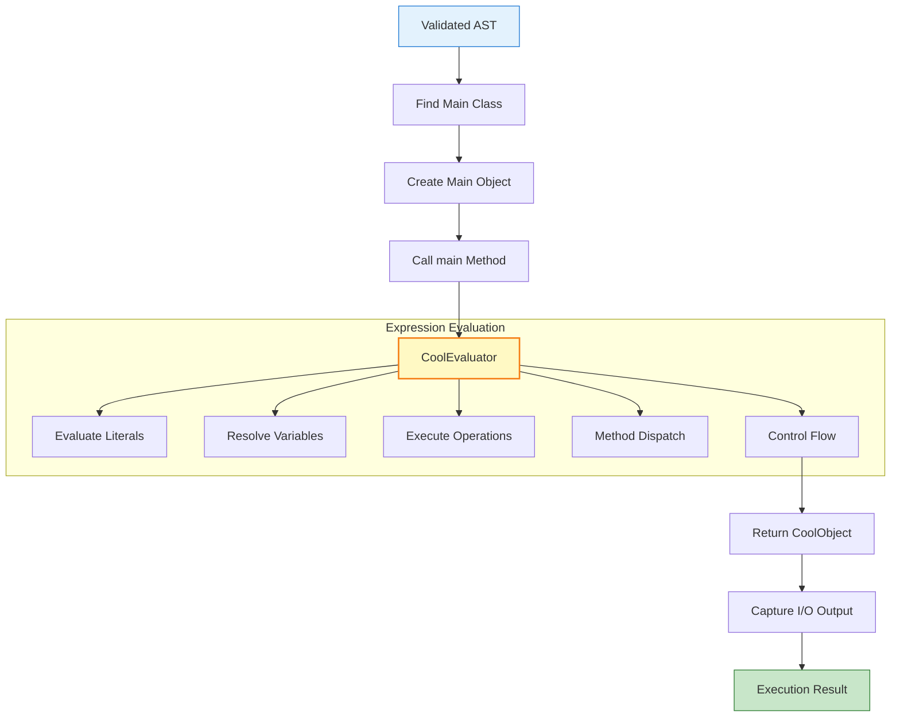
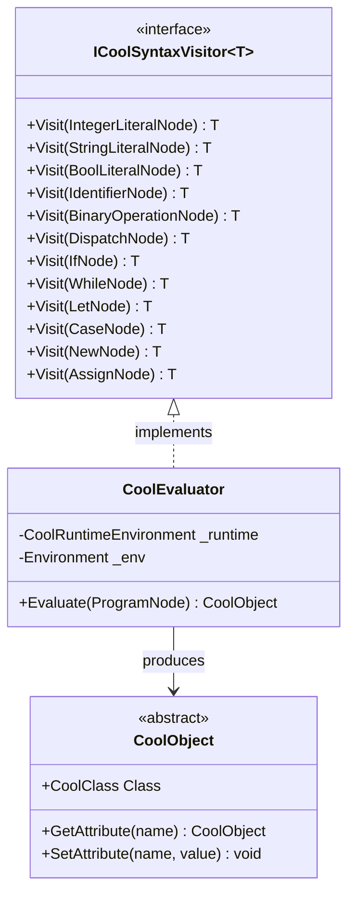
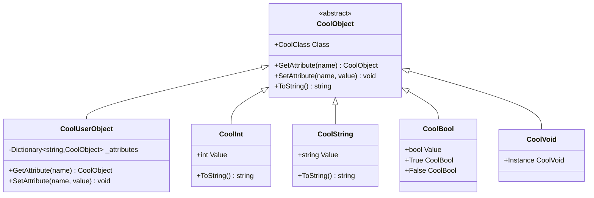
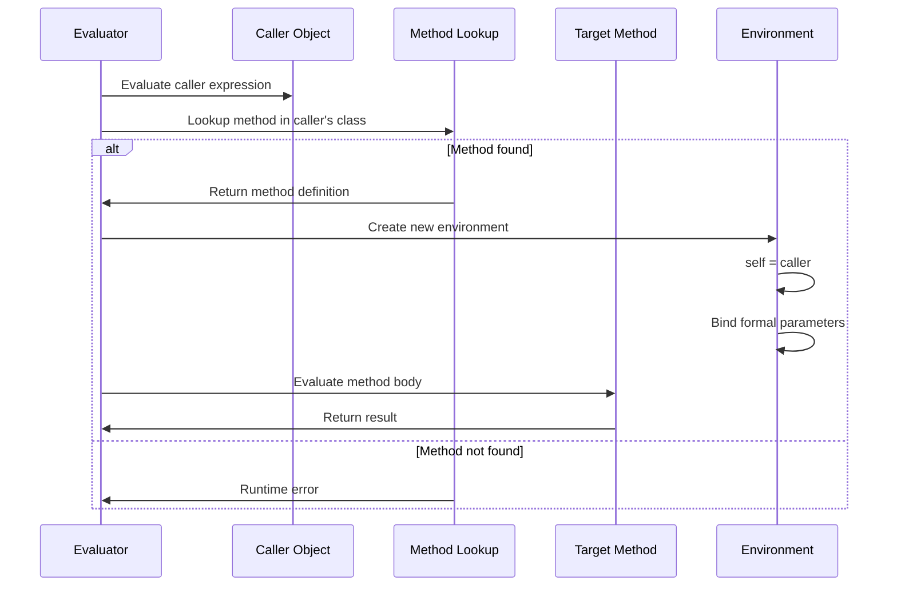

# Runtime Execution

## Table of Contents
1. [Overview](#overview)
2. [Tree-Walk Interpreter](#tree-walk-interpreter)
3. [Object Model](#object-model)
4. [Method Dispatch](#method-dispatch)
5. [Built-in Classes](#built-in-classes)
6. [Memory Management](#memory-management)
7. [Runtime Errors](#runtime-errors)

---

## Overview

The runtime phase executes a validated COOL program using a **tree-walk interpreter**. This approach directly evaluates the AST without compiling to bytecode or machine code.

### Execution Flow



---

## Tree-Walk Interpreter

### CoolEvaluator

**Location:** `Language/Evaluation/CoolEvaluator.cs`

The evaluator implements the Visitor pattern to traverse and execute AST nodes:

```csharp
public class CoolEvaluator : ICoolSyntaxVisitor<CoolObject>
{
    private readonly CoolRuntimeEnvironment _runtime;
    private Environment _env;
    
    public CoolObject Evaluate(ProgramNode program)
    {
        // 1. Find Main class
        var mainClassSymbol = _runtime.SymbolTable.GetClass("Main");
        
        // 2. Find main() method
        var mainMethodNode = mainClassSymbol.Definition.Features
            .OfType<MethodNode>()
            .FirstOrDefault(m => m.Name == "main" && m.Formals.Count == 0);
        
        // 3. Create Main object
        var mainRuntimeClass = RuntimeClassFactory.FromSymbol(mainClassSymbol, _runtime);
        var mainObject = ObjectFactory.Create(mainRuntimeClass, _runtime);
        
        // 4. Set up environment
        _env = Environment.Empty.WithSelf(mainObject);
        
        // 5. Execute main() body
        return mainMethodNode.Body.Accept(this);
    }
}
```

### Visitor Pattern Implementation



### Expression Evaluation Examples

#### Literals
```csharp
public CoolObject Visit(IntegerLiteralNode node)
    => new CoolInt(node.Value);

public CoolObject Visit(StringLiteralNode node)
    => new CoolString(node.Value);

public CoolObject Visit(BoolLiteralNode node)
    => node.Value ? CoolBool.True : CoolBool.False;
```

#### Binary Operations
```csharp
public CoolObject Visit(BinaryOperationNode node)
{
    var left = node.Left.Accept(this);
    var right = node.Right.Accept(this);
    
    switch (node.Operator)
    {
        case BinaryOperator.Add:
            return new CoolInt(((CoolInt)left).Value + ((CoolInt)right).Value);
            
        case BinaryOperator.Sub:
            return new CoolInt(((CoolInt)left).Value - ((CoolInt)right).Value);
            
        case BinaryOperator.Mul:
            return new CoolInt(((CoolInt)left).Value * ((CoolInt)right).Value);
            
        case BinaryOperator.Div:
            var divisor = ((CoolInt)right).Value;
            if (divisor == 0)
                throw new CoolRuntimeException("Division by zero", node.Location);
            return new CoolInt(((CoolInt)left).Value / divisor);
            
        case BinaryOperator.LessThan:
            return ((CoolInt)left).Value < ((CoolInt)right).Value 
                ? CoolBool.True 
                : CoolBool.False;
            
        case BinaryOperator.Equal:
            return Equals(left, right) ? CoolBool.True : CoolBool.False;
            
        default:
            throw new InvalidOperationException($"Unknown operator: {node.Operator}");
    }
}
```

#### If Expression
```csharp
public CoolObject Visit(IfNode node)
{
    var condition = node.Condition.Accept(this);
    
    return ((CoolBool)condition).Value
        ? node.ThenBranch.Accept(this)
        : node.ElseBranch.Accept(this);
}
```

#### While Expression
```csharp
public CoolObject Visit(WhileNode node)
{
    CoolObject result = CoolVoid.Instance;
    
    while (true)
    {
        var condition = node.Condition.Accept(this);
        
        if (!((CoolBool)condition).Value)
            break;
        
        result = node.Body.Accept(this);
    }
    
    return result;
}
```

#### Let Expression
```csharp
public CoolObject Visit(LetNode node)
{
    var newEnv = _env;
    
    // Process each binding sequentially
    foreach (var binding in node.Bindings)
    {
        CoolObject value;
        
        if (binding.Initializer != null)
        {
            // Evaluate initializer in current environment
            var oldEnv = _env;
            _env = newEnv;
            value = binding.Initializer.Accept(this);
            _env = oldEnv;
        }
        else
        {
            // Default initialization
            value = GetDefaultValue(binding.Type);
        }
        
        // Add binding to new environment
        newEnv = newEnv.WithBinding(binding.Name, value);
    }
    
    // Evaluate body in new environment
    return StartEvaluation(node.Body, newEnv);
}
```

#### Case Expression
```csharp
public CoolObject Visit(CaseNode node)
{
    var expr = node.Expression.Accept(this);
    
    // Check for void
    if (expr is CoolVoid)
        throw new CoolRuntimeException("Case on void", node.Location);
    
    // Find matching branch (most specific type first)
    var sortedBranches = node.Branches
        .OrderBy(b => GetTypeDepth(b.Type))
        .Reverse();
    
    foreach (var branch in sortedBranches)
    {
        if (IsInstanceOf(expr, branch.Type))
        {
            // Evaluate branch body with new binding
            var newEnv = _env.WithBinding(branch.Identifier, expr);
            return StartEvaluation(branch.Body, newEnv);
        }
    }
    
    throw new CoolRuntimeException(
        $"No matching case branch for type '{expr.Class.Name}'", 
        node.Location
    );
}
```

---

## Object Model

### Class Hierarchy



### CoolObject Base Class

```csharp
public abstract class CoolObject
{
    public CoolClass Class { get; }
    
    protected CoolObject(CoolClass coolClass)
    {
        Class = coolClass ?? throw new ArgumentNullException(nameof(coolClass));
    }
    
    public abstract CoolObject GetAttribute(string name);
    public abstract void SetAttribute(string name, CoolObject value);
    
    public override string ToString() => $"#{Class.Name}";
}
```

### User-Defined Objects

```csharp
public class CoolUserObject : CoolObject
{
    private readonly Dictionary<string, CoolObject> _attributes;
    
    public CoolUserObject(CoolClass coolClass) : base(coolClass)
    {
        _attributes = new Dictionary<string, CoolObject>();
        
        // Initialize all attributes with default values
        InitializeAttributes();
    }
    
    private void InitializeAttributes()
    {
        foreach (var attr in Class.GetAllAttributes())
        {
            if (attr.Initializer != null)
            {
                // Evaluate initializer
                var evaluator = new CoolEvaluator(_runtime, Environment.Empty.WithSelf(this));
                _attributes[attr.Name] = attr.Initializer.Accept(evaluator);
            }
            else
            {
                // Default value
                _attributes[attr.Name] = GetDefaultValue(attr.Type);
            }
        }
    }
    
    public override CoolObject GetAttribute(string name)
    {
        return _attributes.TryGetValue(name, out var value)
            ? value
            : throw new CoolRuntimeException($"Attribute '{name}' not found");
    }
    
    public override void SetAttribute(string name, CoolObject value)
    {
        if (_attributes.ContainsKey(name))
            _attributes[name] = value;
        else
            throw new CoolRuntimeException($"Attribute '{name}' not found");
    }
}
```

### Primitive Types

#### CoolInt
```csharp
public class CoolInt : CoolObject
{
    public int Value { get; }
    
    public CoolInt(int value) : base(PredefinedClasses.Int)
    {
        Value = value;
    }
    
    public override CoolObject GetAttribute(string name)
        => throw new InvalidOperationException("Int has no attributes");
    
    public override void SetAttribute(string name, CoolObject value)
        => throw new InvalidOperationException("Int has no attributes");
    
    public override string ToString() => Value.ToString();
}
```

#### CoolString
```csharp
public class CoolString : CoolObject
{
    public string Value { get; }
    
    public CoolString(string value) : base(PredefinedClasses.String)
    {
        Value = value ?? throw new ArgumentNullException(nameof(value));
    }
    
    public override string ToString() => Value;
}
```

#### CoolBool
```csharp
public class CoolBool : CoolObject
{
    public static readonly CoolBool True = new CoolBool(true);
    public static readonly CoolBool False = new CoolBool(false);
    
    public bool Value { get; }
    
    private CoolBool(bool value) : base(PredefinedClasses.Bool)
    {
        Value = value;
    }
    
    public override string ToString() => Value ? "true" : "false";
}
```

### Default Values

```csharp
private CoolObject GetDefaultValue(string typeName)
{
    return typeName switch
    {
        "Int" => new CoolInt(0),
        "String" => new CoolString(""),
        "Bool" => CoolBool.False,
        _ => CoolVoid.Instance  // Object types default to void
    };
}
```

---

## Method Dispatch

### Dynamic Dispatch

Method dispatch in COOL is **dynamic** (late-binding) — the method to call is determined at runtime based on the actual type of the receiver object.



### Implementation

```csharp
public CoolObject Visit(DispatchNode node)
{
    // 1. Evaluate caller (receiver object)
    var caller = node.Caller.Accept(this);
    
    if (caller is CoolVoid)
        throw new CoolRuntimeException("Dispatch on void", node.Location);
    
    // 2. Determine target class (static dispatch or dynamic)
    var targetClass = node.StaticType != null
        ? _runtime.GetClass(node.StaticType)
        : caller.Class;
    
    // 3. Look up method
    var method = targetClass.LookupMethod(node.MethodName);
    
    if (method == null)
        throw new CoolRuntimeException(
            $"Method '{node.MethodName}' not found in class '{targetClass.Name}'",
            node.Location
        );
    
    // 4. Evaluate arguments
    var arguments = node.Arguments
        .Select(arg => arg.Accept(this))
        .ToList();
    
    // 5. Call method
    return InvokeMethod(caller, method, arguments, node.Location);
}

private CoolObject InvokeMethod(
    CoolObject receiver, 
    MethodInfo method, 
    List<CoolObject> arguments,
    SourcePosition location)
{
    // Built-in method
    if (method.IsBuiltIn)
        return InvokeBuiltInMethod(receiver, method, arguments, location);
    
    // User-defined method
    var methodNode = method.Definition;
    
    // Create new environment
    var newEnv = Environment.Empty.WithSelf(receiver);
    
    // Bind formal parameters
    for (int i = 0; i < methodNode.Formals.Count; i++)
    {
        newEnv = newEnv.WithBinding(methodNode.Formals[i].Name, arguments[i]);
    }
    
    // Execute method body
    return StartEvaluation(methodNode.Body, newEnv);
}
```

### Static Dispatch

COOL also supports **static dispatch** using the `@` operator:

```cool
class A {
    foo(): String { "A" };
};

class B inherits A {
    foo(): String { "B" };
    
    test(): String {
        self@A.foo()  -- Explicitly call A's foo()
    };
};
```

Implementation:
```csharp
// In Visit(DispatchNode)
var targetClass = node.StaticType != null
    ? _runtime.GetClass(node.StaticType)  // Static dispatch
    : caller.Class;                        // Dynamic dispatch
```

---

## Built-in Classes

### Object Class

```csharp
public class ObjectClass
{
    public static CoolObject Abort(CoolObject self, List<CoolObject> args, SourcePosition location)
    {
        throw new CoolRuntimeException("Abort called", location, CoolErrorCodes.AbortCalled);
    }
    
    public static CoolObject TypeName(CoolObject self, List<CoolObject> args, SourcePosition location)
    {
        return new CoolString(self.Class.Name);
    }
    
    public static CoolObject Copy(CoolObject self, List<CoolObject> args, SourcePosition location)
    {
        if (self is CoolUserObject userObj)
        {
            // Deep copy
            var copy = new CoolUserObject(self.Class);
            foreach (var attr in userObj.Class.GetAllAttributes())
            {
                copy.SetAttribute(attr.Name, userObj.GetAttribute(attr.Name));
            }
            return copy;
        }
        
        // Primitives are immutable, return self
        return self;
    }
}
```

### IO Class

```csharp
public class IOClass
{
    public static CoolObject OutString(
        CoolObject self, 
        List<CoolObject> args, 
        CoolRuntimeEnvironment runtime,
        SourcePosition location)
    {
        var str = (CoolString)args[0];
        runtime.Output.Write(str.Value);
        return self;  // Return SELF_TYPE
    }
    
    public static CoolObject OutInt(
        CoolObject self, 
        List<CoolObject> args, 
        CoolRuntimeEnvironment runtime,
        SourcePosition location)
    {
        var value = (CoolInt)args[0];
        runtime.Output.Write(value.Value);
        return self;
    }
    
    public static CoolObject InString(
        CoolObject self, 
        List<CoolObject> args, 
        CoolRuntimeEnvironment runtime,
        SourcePosition location)
    {
        var line = runtime.Input.ReadLine() ?? "";
        return new CoolString(line);
    }
    
    public static CoolObject InInt(
        CoolObject self, 
        List<CoolObject> args, 
        CoolRuntimeEnvironment runtime,
        SourcePosition location)
    {
        var line = runtime.Input.ReadLine() ?? "0";
        if (int.TryParse(line, out var value))
            return new CoolInt(value);
        return new CoolInt(0);
    }
}
```

### String Class

```csharp
public class StringClass
{
    public static CoolObject Length(CoolObject self, List<CoolObject> args, SourcePosition location)
    {
        var str = (CoolString)self;
        return new CoolInt(str.Value.Length);
    }
    
    public static CoolObject Concat(CoolObject self, List<CoolObject> args, SourcePosition location)
    {
        var str1 = (CoolString)self;
        var str2 = (CoolString)args[0];
        return new CoolString(str1.Value + str2.Value);
    }
    
    public static CoolObject Substr(CoolObject self, List<CoolObject> args, SourcePosition location)
    {
        var str = (CoolString)self;
        var start = ((CoolInt)args[0]).Value;
        var length = ((CoolInt)args[1]).Value;
        
        if (start < 0 || length < 0 || start + length > str.Value.Length)
            throw new CoolRuntimeException("substr out of range", location);
        
        return new CoolString(str.Value.Substring(start, length));
    }
}
```

---

## Memory Management

### Object Creation

```csharp
public class ObjectFactory
{
    public static CoolObject Create(CoolClass coolClass, CoolRuntimeEnvironment runtime)
    {
        switch (coolClass.Name)
        {
            case "Int":
                return new CoolInt(0);
            case "String":
                return new CoolString("");
            case "Bool":
                return CoolBool.False;
            default:
                return new CoolUserObject(coolClass, runtime);
        }
    }
}
```

### Garbage Collection

The interpreter relies on .NET's garbage collector:
- Objects are created on the managed heap
- No manual memory management required
- Objects are collected when no longer reachable

---

## Runtime Errors

### Error Types

#### 1. **Abort Called**
```cool
class Main {
    main(): Object { abort() };
};
```
**Error:** `AbortCalled` — Program terminates

#### 2. **Division by Zero**
```cool
class Main {
    main(): Int { 10 / 0 };
};
```
**Error:** `DivisionByZero` — Arithmetic error

#### 3. **Dispatch on Void**
```cool
class Main {
    main(): Object {
        let x: Object in x.type_name()
    };
};
```
**Error:** `DispatchOnVoid` — Cannot call method on void

#### 4. **Case on Void**
```cool
class Main {
    main(): Object {
        case (let x: Object in x) of
            y: Object => y;
        esac
    };
};
```
**Error:** `CaseOnVoid` — Cannot case on void

#### 5. **Substr Out of Range**
```cool
class Main inherits IO {
    main(): Object {
        out_string("hello".substr(0, 10))
    };
};
```
**Error:** `SubstrOutOfRange` — Index out of bounds

### Exception Handling

```csharp
public class CoolRuntimeException : Exception
{
    public SourcePosition? Location { get; }
    public string? ErrorCode { get; }
    
    public CoolRuntimeException(string message, SourcePosition? location = null, string? errorCode = null)
        : base(message)
    {
        Location = location;
        ErrorCode = errorCode;
    }
}
```

---

## Runtime Environment

### CoolRuntimeEnvironment

```csharp
public class CoolRuntimeEnvironment
{
    public SymbolTable SymbolTable { get; }
    public TextWriter Output { get; }
    public TextReader Input { get; }
    
    public CoolRuntimeEnvironment(SymbolTable symbolTable)
    {
        SymbolTable = symbolTable;
        Output = Console.Out;
        Input = Console.In;
    }
    
    public CoolRuntimeEnvironment WithOutput(TextWriter output)
        => new CoolRuntimeEnvironment(SymbolTable) { Output = output, Input = Input };
    
    public CoolRuntimeEnvironment WithInput(TextReader input)
        => new CoolRuntimeEnvironment(SymbolTable) { Output = Output, Input = input };
}
```

### Environment (Execution Context)

```csharp
public class Environment
{
    public static readonly Environment Empty = new Environment(null, ImmutableDictionary<string, CoolObject>.Empty);
    
    public CoolObject? Self { get; }
    public ImmutableDictionary<string, CoolObject> Bindings { get; }
    
    public Environment WithSelf(CoolObject self)
        => new Environment(self, Bindings);
    
    public Environment WithBinding(string name, CoolObject value)
        => new Environment(Self, Bindings.SetItem(name, value));
    
    public CoolObject? TryGetVariable(string name)
        => Bindings.TryGetValue(name, out var value) ? value : null;
}
```

---

**Next:** Continue to [05-DIAGNOSTICS.md](05-DIAGNOSTICS.md) for error handling details.
