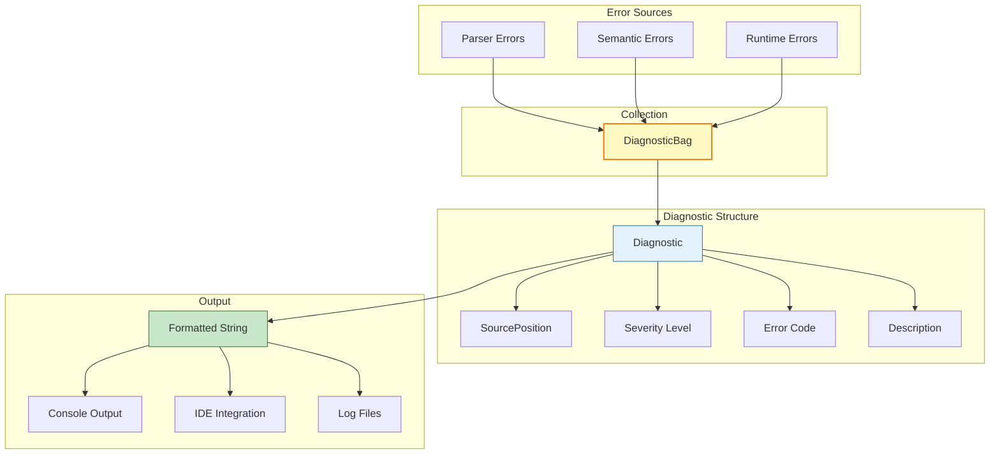
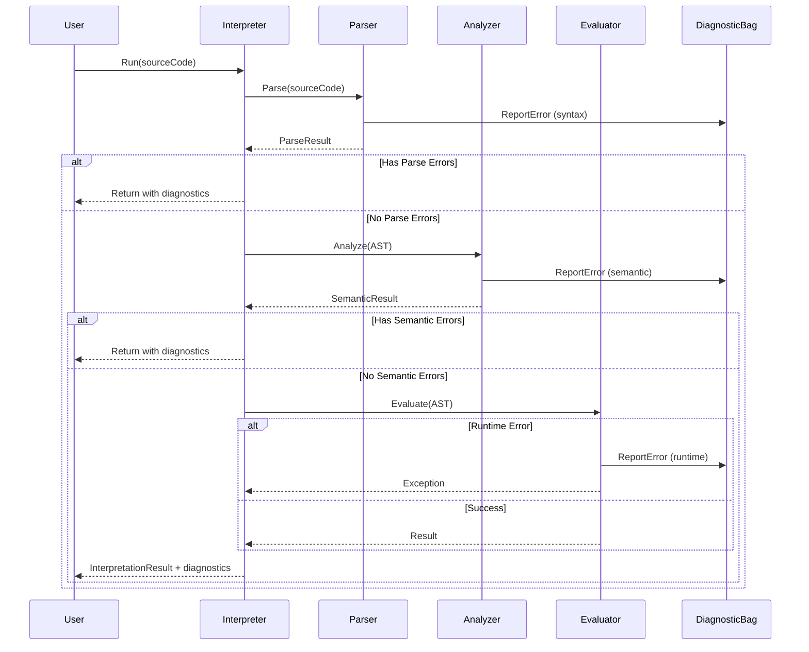

# Error Handling & Diagnostics

## Table of Contents
1. [Overview](#overview)
2. [Diagnostic System](#diagnostic-system)
3. [Error Codes](#error-codes)
4. [Error Reporting](#error-reporting)
5. [Error Recovery](#error-recovery)

---

## Overview

The COOL Interpreter includes a comprehensive diagnostic system that collects and reports errors, warnings, and informational messages throughout all phases of interpretation.

### Design Goals

1. **Accurate Source Location:** Every diagnostic includes file, line, and column information
2. **Meaningful Messages:** Clear, actionable error descriptions
3. **Consistent Format:** Standardized diagnostic output
4. **No Silent Failures:** All errors are reported explicitly
5. **Professional Quality:** IDE-friendly format compatible with VS Code and other tools

---

## Diagnostic System

### Architecture



### DiagnosticBag

**Location:** `Core/Diagnostics/DiagnosticBag.cs`

Central collection for all diagnostics:

```csharp
public class DiagnosticBag
{
    private readonly List<Diagnostic> _diagnostics = new();
    
    public IReadOnlyList<Diagnostic> Diagnostics => _diagnostics;
    
    public bool HasErrors => _diagnostics.Exists(d => d.Severity == DiagnosticSeverity.Error);
    
    public void ReportError(SourcePosition location, string code, string message)
        => _diagnostics.Add(Diagnostic.Error(location, code, message));
    
    public void ReportWarning(SourcePosition location, string code, string message)
        => _diagnostics.Add(Diagnostic.Warning(location, code, message));
    
    public void ReportInfo(SourcePosition location, string code, string message)
        => _diagnostics.Add(Diagnostic.Info(location, code, message));
    
    public void ReportInternal(SourcePosition location, string code, string message)
        => _diagnostics.Add(Diagnostic.Internal(location, code, message));
}
```

### Diagnostic Structure

```csharp
public class Diagnostic
{
    public SourcePosition Location { get; }
    public DiagnosticSeverity Severity { get; }
    public string Code { get; }
    public string Message { get; }
    
    private Diagnostic(SourcePosition location, DiagnosticSeverity severity, string code, string message)
    {
        Location = location;
        Severity = severity;
        Code = code;
        Message = message;
    }
    
    public static Diagnostic Error(SourcePosition location, string code, string message)
        => new Diagnostic(location, DiagnosticSeverity.Error, code, message);
    
    public static Diagnostic Warning(SourcePosition location, string code, string message)
        => new Diagnostic(location, DiagnosticSeverity.Warning, code, message);
    
    public static Diagnostic Info(SourcePosition location, string code, string message)
        => new Diagnostic(location, DiagnosticSeverity.Info, code, message);
    
    public static Diagnostic Internal(SourcePosition location, string code, string message)
        => new Diagnostic(location, DiagnosticSeverity.Internal, code, message);
    
    public override string ToString()
    {
        var severityStr = Severity switch
        {
            DiagnosticSeverity.Error => "error",
            DiagnosticSeverity.Warning => "warning",
            DiagnosticSeverity.Info => "info",
            DiagnosticSeverity.Internal => "internal error",
            _ => "unknown"
        };
        
        return $"{Location}: {severityStr} {Code}: {Message}";
    }
}
```

### Severity Levels

```csharp
public enum DiagnosticSeverity
{
    Error,      // Prevents execution
    Warning,    // Suspicious but allowed
    Info,       // Informational message
    Internal    // Internal compiler error (bug)
}
```

### Source Position

```csharp
public class SourcePosition
{
    public static readonly SourcePosition None = new SourcePosition("<unknown>", 0, 0);
    
    public string FileName { get; }
    public int Line { get; }
    public int Column { get; }
    
    public SourcePosition(string fileName, int line, int column)
    {
        FileName = fileName ?? "<unknown>";
        Line = line;
        Column = column;
    }
    
    public override string ToString()
        => Line > 0 ? $"{FileName}({Line},{Column})" : FileName;
}
```

---

## Error Codes

### Code Categories

All error codes follow the pattern: `COOL[X][NNN]`
- `X`: Category code (0-9)
- `NNN`: Specific error number (000-999)

```mermaid
graph TB
    Codes[Error Codes] --> Parse[0xxx: Parse Errors]
    Codes --> Semantic[1xxx: Semantic Errors]
    Codes --> Runtime[2xxx: Runtime Errors]
    Codes --> Internal[9xxx: Internal Errors]
    
    Parse --> P1[COOL0001: Syntax Error]
    Parse --> P2[COOL0002: Lexical Error]
    
    Semantic --> S1[COOL0101: Undefined Type]
    Semantic --> S2[COOL0102: Type Mismatch]
    Semantic --> S3[COOL0103: Undeclared Identifier]
    Semantic --> S4[COOL0104: Undefined Method]
    Semantic --> S5[COOL0105: Duplicate Class]
    Semantic --> S6[COOL0106: Inheritance Cycle]
    Semantic --> S7[COOL0107: Invalid Override]
    
    Runtime --> R1[COOL0201: Division by Zero]
    Runtime --> R2[COOL0202: Dispatch on Void]
    Runtime --> R3[COOL0203: Case on Void]
    Runtime --> R4[COOL0204: Abort Called]
    Runtime --> R5[COOL0205: Substr Out of Range]
    
    Internal --> I1[COOL9001: Internal Error]
    
    style Codes fill:#e3f2fd,stroke:#1976d2,stroke-width:2px
    style Parse fill:#fff3e0,stroke:#e65100
    style Semantic fill:#f3e5f5,stroke:#6a1b9a
    style Runtime fill:#ffebee,stroke:#c62828
    style Internal fill:#fce4ec,stroke:#880e4f
```



### Error Code Definitions

**Location:** `Core/Diagnostics/CoolErrorCodes.cs`

```csharp
public static class CoolErrorCodes
{
    // ===== Parse Errors (0xxx) =====
    public const string SyntaxError = "COOL0001";
    public const string LexicalError = "COOL0002";
    
    // ===== Semantic Errors (1xxx) =====
    public const string UndefinedType = "COOL0101";
    public const string TypeMismatch = "COOL0102";
    public const string UndeclaredIdentifier = "COOL0103";
    public const string UndefinedMethod = "COOL0104";
    public const string DuplicateClass = "COOL0105";
    public const string InheritanceCycle = "COOL0106";
    public const string InvalidMethodOverride = "COOL0107";
    public const string UndefinedParentClass = "COOL0108";
    public const string CannotInheritFromClass = "COOL0109";
    public const string RedefineBuiltInClass = "COOL0110";
    public const string DuplicateAttribute = "COOL0111";
    public const string DuplicateMethod = "COOL0112";
    public const string DuplicateFormal = "COOL0113";
    public const string ArgumentCountMismatch = "COOL0114";
    public const string DuplicateCaseBranch = "COOL0115";
    public const string AttributeRedefinition = "COOL0116";
    
    // ===== Runtime Errors (2xxx) =====
    public const string DivisionByZero = "COOL0201";
    public const string DispatchOnVoid = "COOL0202";
    public const string CaseOnVoid = "COOL0203";
    public const string AbortCalled = "COOL0204";
    public const string SubstrOutOfRange = "COOL0205";
    public const string RuntimeError = "COOL0299";
    
    // ===== Internal Errors (9xxx) =====
    public const string InternalInterpreterError = "COOL9001";
}
```

---

## Error Reporting

### Phase-Specific Error Reporting

#### 1. **Parse Errors**

Captured by custom ANTLR error listener:

```csharp
public class DiagnosticErrorListener : BaseErrorListener
{
    private readonly DiagnosticBag _diagnostics;
    private readonly string _fileName;
    
    public override void SyntaxError(
        TextWriter output,
        IRecognizer recognizer,
        IToken offendingSymbol,
        int line,
        int charPositionInLine,
        string msg,
        RecognitionException e)
    {
        var location = new SourcePosition(_fileName, line, charPositionInLine);
        
        _diagnostics.ReportError(
            location,
            CoolErrorCodes.SyntaxError,
            $"Syntax error: {msg}"
        );
    }
}
```

**Example Output:**
```
hello.cool(12,8): error COOL0001: Syntax error: missing ';' at '}'
```

#### 2. **Semantic Errors**

Collected during semantic analysis:

```csharp
// Type mismatch
_diagnostics.ReportError(
    node.Location,
    CoolErrorCodes.TypeMismatch,
    $"Expected type '{expectedType}', got '{actualType}'"
);

// Undefined identifier
_diagnostics.ReportError(
    node.Location,
    CoolErrorCodes.UndeclaredIdentifier,
    $"Undeclared identifier '{node.Name}'"
);

// Inheritance cycle
_diagnostics.ReportError(
    classSymbol.Location,
    CoolErrorCodes.InheritanceCycle,
    $"Class '{classSymbol.Name}' is part of an inheritance cycle"
);
```

**Example Output:**
```
program.cool(15,12): error COOL0103: Undeclared identifier 'x'
program.cool(8,7): error COOL0102: Expected type 'Int', got 'String'
```

#### 3. **Runtime Errors**

Converted from exceptions:

```csharp
try
{
    var evaluator = new CoolEvaluator(runtimeEnv);
    returnedValue = evaluator.Evaluate(parseResult.SyntaxTree);
}
catch (CoolRuntimeException ex)
{
    var code = ex.ErrorCode ?? CoolErrorCodes.RuntimeError;
    
    executionDiagnostics.ReportError(
        ex.Location ?? SourcePosition.None,
        code,
        ex.Message
    );
}
```

**Example Output:**
```
calculator.cool(23,15): error COOL0201: Division by zero
program.cool(42,9): error COOL0204: Abort called
```

---

## Error Examples by Category

### Syntax Errors

```cool
-- Missing semicolon
class Main {
    main(): Int { 42 }  -- ERROR: COOL0001
};

-- Invalid token
class Main {
    main(): Int { 42 $ };  -- ERROR: COOL0001
};

-- Mismatched braces
class Main {
    main(): Int { 42 };
-- ERROR: COOL0001: missing '}'
```

### Semantic Errors

#### Type Errors
```cool
-- Type mismatch
class Main {
    main(): Int {
        "hello"  -- ERROR: COOL0102: Expected Int, got String
    };
};

-- Undefined type
class Main {
    x: Foo;  -- ERROR: COOL0101: Type 'Foo' is not defined
};
```

#### Identifier Errors
```cool
-- Undeclared identifier
class Main {
    main(): Int {
        x  -- ERROR: COOL0103: Undeclared identifier 'x'
    };
};

-- Undefined method
class Main {
    main(): Int {
        self.foo()  -- ERROR: COOL0104: Method 'foo' not found
    };
};
```

#### Class Errors
```cool
-- Duplicate class
class Foo { };
class Foo { };  -- ERROR: COOL0105: Class 'Foo' is already defined

-- Inheritance cycle
class A inherits B { };
class B inherits A { };  -- ERROR: COOL0106: Inheritance cycle

-- Cannot inherit from Int
class MyInt inherits Int { };  -- ERROR: COOL0109
```

#### Method Errors
```cool
-- Invalid override
class A {
    foo(x: Int): String { "a" };
};

class B inherits A {
    foo(x: String): String { "b" };  -- ERROR: COOL0107
};

-- Argument count mismatch
class Main {
    foo(x: Int, y: Int): Int { x + y };
    
    main(): Int {
        foo(42)  -- ERROR: COOL0114: Expected 2 arguments, got 1
    };
};
```

### Runtime Errors

```cool
-- Division by zero
class Main {
    main(): Int {
        10 / 0  -- ERROR: COOL0201: Division by zero
    };
};

-- Dispatch on void
class Main {
    main(): Object {
        let x: Object in x.type_name()  -- ERROR: COOL0202
    };
};

-- Substr out of range
class Main inherits IO {
    main(): Object {
        out_string("hello".substr(0, 10))  -- ERROR: COOL0205
    };
};

-- Abort called
class Main {
    main(): Object {
        abort()  -- ERROR: COOL0204: Abort called
    };
};
```

---

## Error Recovery

### Parse Error Recovery

ANTLR provides automatic error recovery:
- Attempts to synchronize on statement boundaries
- Continues parsing to find additional errors
- May produce incomplete parse tree

```csharp
public ParseResult Parse(string sourceCode, string sourceName)
{
    // ... setup code ...
    
    var programContext = parser.program();
    
    // Only build AST if no errors
    ProgramNode? syntaxTree = null;
    if (!diagnostics.HasErrors)
    {
        syntaxTree = astBuilder.Visit(programContext) as ProgramNode;
    }
    
    return new ParseResult(syntaxTree, diagnostics.Diagnostics);
}
```

### Semantic Error Recovery

Type checker continues after errors to find more issues:

```csharp
// Return default type on error for continued checking
if (!IsValidType(attribute.Type))
{
    _diagnostics.ReportError(...);
    return "Object";  // Error recovery type
}
```

### Runtime Error Termination

Runtime errors terminate execution immediately:

```csharp
catch (CoolRuntimeException ex)
{
    executionDiagnostics.ReportError(ex.Location, ex.ErrorCode, ex.Message);
    return InterpretationResult.Failure(...);
}
```

---

## Diagnostic Output Format

### Standard Format

All diagnostics follow this format:
```
<fileName>(<line>,<column>): <severity> <code>: <message>
```

### Examples

```
hello.cool(12,8): error COOL0001: Syntax error: missing ';'
program.cool(15,12): error COOL0103: Undeclared identifier 'x'
main.cool(23,15): error COOL0201: Division by zero
test.cool(5,3): warning COOLW001: Unused variable 'temp'
```

### IDE Integration

This format is compatible with:
- **VS Code:** Clickable errors in Problems panel
- **Visual Studio:** Error List window
- **JetBrains IDEs:** Problems tool window
- **Command-line tools:** Parseable format

---

## Diagnostic Collection Flow



---

## Testing Diagnostics

**Location:** `Cool.Interpreter.Tests/SemanticTests.cs`, `RuntimeTests.cs`

```csharp
[Test]
public void Semantic_UndefinedType_ReportsCorrectError()
{
    const string code = @"
        class Main {
            x: Foo;
        };
    ";
    
    var result = _interpreter.TestSemantics(code);
    
    Assert.Multiple(() =>
    {
        Assert.That(result.IsSuccess, Is.False);
        Assert.That(result.Diagnostics.Any(d => 
            d.Code == CoolErrorCodes.UndefinedType), Is.True);
        Assert.That(result.Diagnostics.Any(d => 
            d.Message.Contains("Foo")), Is.True);
    });
}

[Test]
public void Runtime_DivisionByZero_ReportsError()
{
    const string code = @"
        class Main {
            main(): Int { 10 / 0 };
        };
    ";
    
    var result = _interpreter.Run(code);
    
    Assert.Multiple(() =>
    {
        Assert.That(result.IsSuccess, Is.False);
        Assert.That(result.Diagnostics.Any(d => 
            d.Code == CoolErrorCodes.DivisionByZero), Is.True);
    });
}
```

---

**Next:** Continue to [06-TESTING.md](06-TESTING.md) for testing strategy details.
