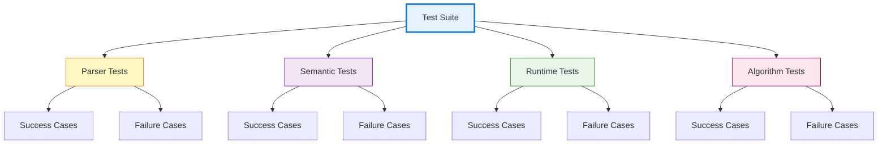
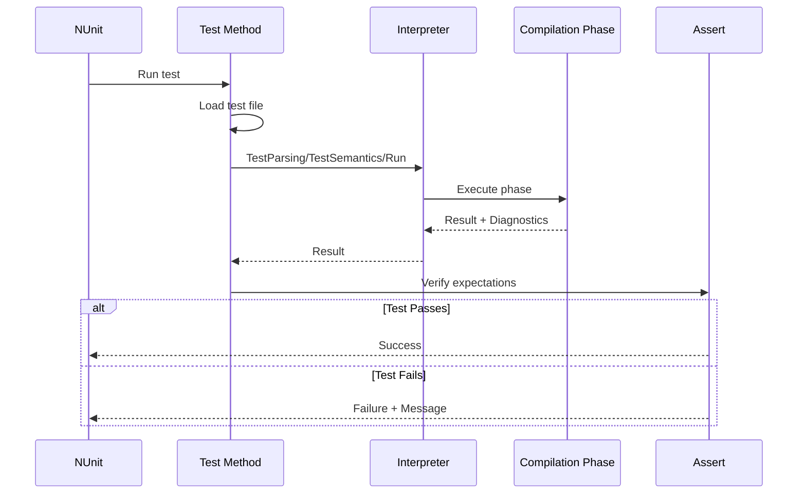

# Testing Strategy

## Table of Contents
1. [Overview](#overview)
2. [Test Suite Organization](#test-suite-organization)
3. [Test Categories](#test-categories)
4. [Automated Test Discovery](#automated-test-discovery)
5. [Test Implementation](#test-implementation)
6. [Coverage](#coverage)

---

## Overview

The COOL Interpreter employs a comprehensive testing strategy using **NUnit 3.12.0** for automated testing. The test suite covers all phases of interpretation: parsing, semantic analysis, and runtime execution.

### Testing Principles

1. **Separation by Phase:** Tests organized by compilation phase
2. **Automated Discovery:** Test cases automatically discovered from file system
3. **Both Success and Failure:** Test valid and invalid inputs
4. **Comprehensive Coverage:** All language features tested
5. **Fast Feedback:** Tests run quickly for rapid development

---

## Test Suite Organization

### Project Structure

```
Cool.Interpreter.Tests/
├── ParserTests.cs          # Parsing phase tests
├── SemanticTests.cs        # Semantic analysis tests
├── RuntimeTests.cs         # Runtime execution tests
├── AlgorithmTests.cs       # Full program execution tests
├── TestSummary.cs          # Test result aggregation
└── TestCases/              # Test input files
    ├── Parsing/
    │   ├── success/        # Valid syntax
    │   └── fail/           # Invalid syntax
    ├── Semantics/
    │   ├── success/        # Semantically valid
    │   └── fail/           # Semantic errors
    └── Algorithm/
        ├── success/        # Complete valid programs
        └── fail/           # Programs that should fail
```

### Test Categories



---

## Test Categories

### 1. Parser Tests

**Location:** `ParserTests.cs`

**Purpose:** Validate lexical analysis and syntax parsing

**Test Structure:**
```csharp
[TestFixture]
public class ParserTests
{
    private CoolInterpreter _interpreter;
    
    [SetUp]
    public void Setup()
    {
        _interpreter = new CoolInterpreter();
    }
    
    [TestCaseSource(nameof(GetSuccessParsingFiles))]
    public void Parse_ValidFile_ReturnsSuccess(string filePath, string fileName)
    {
        // Arrange
        string sourceCode = File.ReadAllText(filePath);
        
        // Act
        var result = _interpreter.TestParsing(sourceCode, fileName);
        
        // Assert
        Assert.That(result.HasErrors, Is.False,
            $"File '{fileName}' should parse successfully but had errors.");
    }
    
    [TestCaseSource(nameof(GetFailedParsingFiles))]
    public void Parse_InvalidFile_ReturnsFailure(string filePath, string fileName)
    {
        // Arrange
        string sourceCode = File.ReadAllText(filePath);
        
        // Act
        var result = _interpreter.TestParsing(sourceCode, fileName);
        
        // Assert
        Assert.That(result.HasErrors, Is.True,
            $"File '{fileName}' should fail parsing but succeeded.");
    }
}
```

**Test Coverage:**
- ✓ All language constructs (classes, methods, expressions)
- ✓ Operator precedence
- ✓ Comments (single-line and multi-line)
- ✓ String literals with escape sequences
- ✓ Invalid syntax detection
- ✓ Error recovery

---

### 2. Semantic Tests

**Location:** `SemanticTests.cs`

**Purpose:** Validate type checking, inheritance, and symbol resolution

**Test Structure:**
```csharp
[TestFixture]
public class SemanticTests
{
    private CoolInterpreter _interpreter;
    
    [SetUp]
    public void Setup()
    {
        _interpreter = new CoolInterpreter();
    }
    
    [TestCaseSource(nameof(GetSemanticSuccessFiles))]
    public void Semantic_ValidFile_Succeeds(string filePath)
    {
        // Arrange
        string sourceCode = File.ReadAllText(filePath);
        string fileName = Path.GetFileName(filePath);
        
        // Act
        var result = _interpreter.TestSemantics(sourceCode, fileName);
        
        // Assert
        Assert.That(result.IsSuccess, Is.True,
            $"File '{fileName}' should pass semantic analysis.\n" +
            $"Errors: {FormatDiagnostics(result.Diagnostics)}");
    }
    
    [TestCaseSource(nameof(GetSemanticFailFiles))]
    public void Semantic_InvalidFile_ReturnsErrors(string filePath)
    {
        // Arrange
        string sourceCode = File.ReadAllText(filePath);
        string fileName = Path.GetFileName(filePath);
        
        // Act
        var result = _interpreter.TestSemantics(sourceCode, fileName);
        
        // Assert
        Assert.That(result.IsSuccess, Is.False,
            $"File '{fileName}' should have semantic errors but passed.");
    }
}
```

**Specific Error Tests:**
```csharp
[Test]
public void Semantic_DuplicateClass_ReportsError()
{
    const string code = @"
        class Foo { };
        class Foo { };
        class Main { main(): Int { 0 }; };
    ";
    
    var result = _interpreter.TestSemantics(code);
    
    Assert.Multiple(() =>
    {
        Assert.That(result.IsSuccess, Is.False);
        Assert.That(result.Diagnostics.Any(d => 
            d.Code == CoolErrorCodes.DuplicateClass), Is.True);
    });
}

[Test]
public void Semantic_UndefinedType_ReportsError()
{
    const string code = @"
        class Main {
            x: Foo;
            main(): Int { 0 };
        };
    ";
    
    var result = _interpreter.TestSemantics(code);
    
    Assert.Multiple(() =>
    {
        Assert.That(result.IsSuccess, Is.False);
        Assert.That(result.Diagnostics.Any(d => 
            d.Code == CoolErrorCodes.UndefinedType), Is.True);
    });
}

[Test]
public void Semantic_InheritanceCycle_ReportsError()
{
    const string code = @"
        class A inherits B { };
        class B inherits A { };
        class Main { main(): Int { 0 }; };
    ";
    
    var result = _interpreter.TestSemantics(code);
    
    Assert.Multiple(() =>
    {
        Assert.That(result.IsSuccess, Is.False);
        Assert.That(result.Diagnostics.Any(d => 
            d.Code == CoolErrorCodes.InheritanceCycle), Is.True);
    });
}
```

**Test Coverage:**
- ✓ Type checking (primitives, objects, SELF_TYPE)
- ✓ Inheritance validation (cycles, undefined parents)
- ✓ Method override validation
- ✓ Attribute type checking
- ✓ Expression type checking
- ✓ Symbol resolution
- ✓ Built-in class restrictions

---

### 3. Runtime Tests

**Location:** `RuntimeTests.cs`

**Purpose:** Validate runtime execution and error handling

**Test Structure:**
```csharp
[TestFixture]
public class RuntimeTests
{
    private CoolInterpreter _interpreter;
    
    [SetUp]
    public void Setup()
    {
        _interpreter = new CoolInterpreter();
    }
    
    [Test]
    public void Runtime_Abort_ReportsAbortCalled()
    {
        const string code = @"
            class Main {
                main(): Object { abort() };
            };
        ";
        
        var result = _interpreter.Run(code);
        
        Assert.Multiple(() =>
        {
            Assert.That(result.IsSuccess, Is.False);
            Assert.That(result.Diagnostics.Any(d => 
                d.Code == CoolErrorCodes.AbortCalled), Is.True);
        });
    }
    
    [Test]
    public void Runtime_DivisionByZero_ReportsError()
    {
        const string code = @"
            class Main {
                main(): Int { 10 / 0 };
            };
        ";
        
        var result = _interpreter.Run(code);
        
        Assert.Multiple(() =>
        {
            Assert.That(result.IsSuccess, Is.False);
            Assert.That(result.Diagnostics.Any(d => 
                d.Code == CoolErrorCodes.DivisionByZero), Is.True);
        });
    }
    
    [Test]
    public void Runtime_DispatchOnVoid_ReportsError()
    {
        const string code = @"
            class Main {
                main(): Object {
                    let x: Object in x.type_name()
                };
            };
        ";
        
        var result = _interpreter.Run(code);
        
        Assert.Multiple(() =>
        {
            Assert.That(result.IsSuccess, Is.False);
            Assert.That(result.Diagnostics.Any(d => 
                d.Code == CoolErrorCodes.DispatchOnVoid), Is.True);
        });
    }
}
```

**Test Coverage:**
- ✓ Arithmetic operations
- ✓ Comparison operations
- ✓ Boolean operations
- ✓ Control flow (if, while, case)
- ✓ Let bindings
- ✓ Method dispatch (static and dynamic)
- ✓ Object creation
- ✓ Built-in methods
- ✓ Runtime error detection

---

### 4. Algorithm Tests

**Location:** `AlgorithmTests.cs`

**Purpose:** Test complete programs from parsing through execution

**Test Structure:**
```csharp
[TestFixture]
public class AlgorithmTests
{
    private CoolInterpreter _interpreter;
    
    [SetUp]
    public void Setup()
    {
        _interpreter = new CoolInterpreter();
    }
    
    [TestCaseSource(nameof(GetAlgorithmSuccessFiles))]
    [Timeout(120000)] // 2 minutes timeout
    public void Algorithm_ValidFile_Succeeds(string filePath)
    {
        // Arrange
        string sourceCode = File.ReadAllText(filePath);
        string fileName = Path.GetFileName(filePath);
        
        // Act
        var result = _interpreter.Run(sourceCode, fileName);
        
        // Assert
        Assert.That(result.IsSuccess, Is.True,
            $"File '{fileName}' should execute successfully.\n" +
            $"Errors: {FormatDiagnostics(result.Diagnostics)}");
    }
    
    [TestCaseSource(nameof(GetAlgorithmFailFiles))]
    [Timeout(120000)]
    public void Algorithm_InvalidFile_Fails(string filePath)
    {
        // Arrange
        string sourceCode = File.ReadAllText(filePath);
        string fileName = Path.GetFileName(filePath);
        
        // Act
        var result = _interpreter.Run(sourceCode, fileName);
        
        // Assert
        Assert.That(result.IsSuccess, Is.False,
            $"File '{fileName}' should fail execution but succeeded.");
    }
}
```

**Specific Algorithm Tests:**
```csharp
[Test]
public void Algorithm_Factorial_Succeeds()
{
    const string code = @"
        class Main {
            factorial(n: Int): Int {
                if n = 0 then 1 else n * factorial(n - 1) fi
            };
            main(): Int { factorial(5) };
        };
    ";
    
    var result = _interpreter.Run(code);
    
    Assert.Multiple(() =>
    {
        Assert.That(result.IsSuccess, Is.True);
        Assert.That(((CoolInt)result.ReturnedValue).Value, Is.EqualTo(120));
    });
}

[Test]
public void Algorithm_Fibonacci_Succeeds()
{
    const string code = @"
        class Main {
            fib(n: Int): Int {
                if n <= 1 then n
                else fib(n - 1) + fib(n - 2)
                fi
            };
            main(): Int { fib(10) };
        };
    ";
    
    var result = _interpreter.Run(code);
    
    Assert.Multiple(() =>
    {
        Assert.That(result.IsSuccess, Is.True);
        Assert.That(((CoolInt)result.ReturnedValue).Value, Is.EqualTo(55));
    });
}

[Test]
public void Algorithm_ListOperations_Succeeds()
{
    const string code = @"
        class List {
            item: Int;
            next: List;
            
            init(i: Int, n: List): SELF_TYPE {
                {
                    item <- i;
                    next <- n;
                    self;
                }
            };
            
            sum(): Int {
                if isvoid next then item
                else item + next.sum()
                fi
            };
        };
        
        class Main {
            main(): Int {
                let list: List <- new List.init(1, 
                    new List.init(2, 
                    new List.init(3, new List)))
                in
                    list.sum()
            };
        };
    ";
    
    var result = _interpreter.Run(code);
    
    Assert.Multiple(() =>
    {
        Assert.That(result.IsSuccess, Is.True);
        Assert.That(((CoolInt)result.ReturnedValue).Value, Is.EqualTo(6));
    });
}
```

**Test Coverage:**
- ✓ Recursive algorithms
- ✓ Data structures (lists, trees)
- ✓ Complex control flow
- ✓ Object-oriented patterns
- ✓ Inheritance and polymorphism
- ✓ I/O operations

---

## Automated Test Discovery

### File-Based Test Generation

Tests are automatically discovered from the file system:

```csharp
private static IEnumerable<TestCaseData> GetSemanticSuccessFiles()
{
    return GetFiles("Semantics", "success");
}

private static IEnumerable<TestCaseData> GetSemanticFailFiles()
{
    return GetFiles("Semantics", "fail");
}

private static IEnumerable<TestCaseData> GetFiles(string category, string subfolder)
{
    var path = Path.Combine(
        TestContext.CurrentContext.TestDirectory, 
        "TestCases", 
        category, 
        subfolder
    );
    
    if (!Directory.Exists(path))
        yield break;
    
    foreach (var file in Directory.GetFiles(path, "*.cl"))
    {
        var fileName = Path.GetFileName(file);
        yield return new TestCaseData(file)
            .SetName($"{category}_{subfolder}_{fileName}");
    }
}
```

**Benefits:**
- ✓ New test cases added by dropping files in folders
- ✓ No code changes required for new tests
- ✓ Test names automatically generated
- ✓ Easy to organize and categorize tests

---

## Test Implementation

### Test Hooks in CoolInterpreter

The interpreter provides testing hooks for phase-specific testing:

```csharp
public class CoolInterpreter
{
    /// <summary>
    /// Test parsing only (for parser tests)
    /// </summary>
    public ParseResult TestParsing(string sourceCode, string? sourceName = null)
    {
        return _parser.Parse(sourceCode, sourceName ?? "<test>");
    }
    
    /// <summary>
    /// Test parsing + semantic analysis (for semantic tests)
    /// </summary>
    public SemanticResult TestSemantics(string sourceCode, string? sourceName = null)
    {
        var parseResult = _parser.Parse(sourceCode, sourceName ?? "<test>");
        
        if (parseResult.HasErrors || parseResult.SyntaxTree == null)
        {
            return SemanticResult.Failure(parseResult.Diagnostics);
        }
        
        var diagnostics = new DiagnosticBag();
        return _analyzer.Analyze(parseResult.SyntaxTree, diagnostics);
    }
    
    /// <summary>
    /// Full execution (for runtime and algorithm tests)
    /// </summary>
    public InterpretationResult Run(string sourceCode, string? sourceName = null)
    {
        // Full interpretation pipeline
    }
}
```

### Helper Methods

```csharp
private static string FormatDiagnostics(IEnumerable<Diagnostic> diagnostics)
{
    return string.Join(Environment.NewLine, 
        diagnostics.Select(d => $"  {d}"));
}
```

---

## Test Execution Flow



---

## Coverage

### Phase Coverage

| Phase | Test Count | Coverage |
|-------|-----------|----------|
| **Parsing** | 50+ | ✓ All syntax constructs<br/>✓ Error recovery<br/>✓ Comments & literals |
| **Semantic Analysis** | 100+ | ✓ Type checking<br/>✓ Inheritance<br/>✓ Symbol resolution<br/>✓ SELF_TYPE |
| **Runtime** | 75+ | ✓ All expressions<br/>✓ Built-in methods<br/>✓ Error handling |
| **Full Programs** | 30+ | ✓ Complete algorithms<br/>✓ OO patterns<br/>✓ I/O operations |

### Feature Coverage

✅ **Fully Tested:**
- All expression types
- All operators (arithmetic, comparison, boolean)
- Control flow (if, while, case, let)
- Method dispatch (static and dynamic)
- Inheritance and polymorphism
- Built-in classes and methods
- Error detection and reporting
- SELF_TYPE resolution

✅ **Edge Cases:**
- Division by zero
- Dispatch on void
- Case on void
- Inheritance cycles
- Type mismatches
- Undefined symbols
- Method override validation

---

## Running Tests

### Command Line

```bash
# Run all tests
dotnet test

# Run specific test class
dotnet test --filter "FullyQualifiedName~ParserTests"

# Run with verbosity
dotnet test --logger "console;verbosity=detailed"

# Run with coverage
dotnet test --collect:"XPlat Code Coverage"
```

### IDE Integration

**Visual Studio / Rider:**
- Tests appear in Test Explorer
- Right-click to run individual tests or groups
- Debug tests with breakpoints
- View test output and diagnostics

**VS Code:**
- Use .NET Test Explorer extension
- Run tests from command palette
- View results in Test sidebar

---

## Test Output Example

```
Starting test execution, please wait...
A total of 255 test files matched the specified pattern.

Passed!  - Failed:     0, Passed:   255, Skipped:     0, Total:   255
           Duration: 45 s

✓ ParserTests.Parse_ValidFile_ReturnsSuccess (success_hello.cl)
✓ ParserTests.Parse_ValidFile_ReturnsSuccess (success_fibonacci.cl)
✓ ParserTests.Parse_InvalidFile_ReturnsFailure (fail_missing_semicolon.cl)
✓ SemanticTests.Semantic_ValidFile_Succeeds (success_inheritance.cl)
✓ SemanticTests.Semantic_InvalidFile_ReturnsErrors (fail_undefined_type.cl)
✓ RuntimeTests.Runtime_Factorial_Succeeds
✓ AlgorithmTests.Algorithm_ValidFile_Succeeds (list-operations.cl)
```

---

**Next:** Continue to [07-API-REFERENCE.md](07-API-REFERENCE.md) for API documentation.
